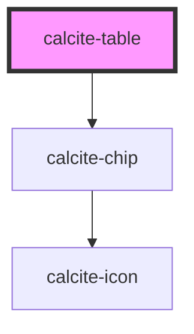

# calcite-table

<!-- Auto Generated Below -->

## Properties

| Property               | Attribute        | Description                                                   | Type                                                           | Default     |
| ---------------------- | ---------------- | ------------------------------------------------------------- | -------------------------------------------------------------- | ----------- |
| `appearance`           | `appearance`     | Specifies the appearance of the component.                    | `"bordered" \| "bordered-zebra" \| "simple" \| "simple-zebra"` | `"simple"`  |
| `caption` _(required)_ | `caption`        | Specifies an accessible title for the component.              | `string`                                                       | `undefined` |
| `layout`               | `layout`         | Specifies the layout of the component.                        | `"auto" \| "fixed"`                                            | `"auto"`    |
| `numbered`             | `numbered`       | When `true`, displays the position of the row in numeric form | `boolean`                                                      | `false`     |
| `scale`                | `scale`          | Specifies the size of the component.                          | `"l" \| "m" \| "s"`                                            | `"m"`       |
| `selectedItems`        | --               | Specifies the component's selected items.                     | `HTMLCalciteTableRowElement[]`                                 | `[]`        |
| `selectionMode`        | `selection-mode` | Specifies the selection mode of the component.                | `"multiple" \| "none" \| "single"`                             | `"none"`    |

## Events

| Event                | Description                                   | Type                |
| -------------------- | --------------------------------------------- | ------------------- |
| `calciteTableSelect` | Emits when the component's selection changes. | `CustomEvent<void>` |

## Slots

| Slot                                                                                          | Description                                                                                                                            |
| --------------------------------------------------------------------------------------------- | -------------------------------------------------------------------------------------------------------------------------------------- |
|                                                                                               | A slot for adding `calcite-table-row` or nested `calcite-table` elements. Content placed here will be rendered in a `table-body` tag.  |
| `"selection-actions"`                                                                         | A slot for adding a `calcite-action` or other element to display when `selectionMode !== "none"` and `calcite-table-row` are selected. |
| `"selection-actions"`                                                                         | A slot for adding a `calcite-action` or other element to display when `selectionMode !== "none"` and `calcite-table-row` are selected. |
| `"table-foot- A slot for adding`calcite-table-row`and nested`calcite-table-header`elements."` |                                                                                                                                        |
| `"table-head- A slot for adding`calcite-table-row`and nested`calcite-table-header`elements."` |                                                                                                                                        |

## Dependencies

### Depends on

- [calcite-chip](../chip)

### Graph

---

_Built with [StencilJS](https://stenciljs.com/)_
