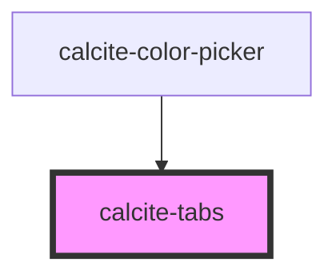

# calcite-tabs

For comprehensive guidance on using and implementing `calcite-tabs`, refer to the [documentation page](https://developers.arcgis.com/calcite-design-system/components/tabs/).

<!-- Auto Generated Below -->

## Properties

| Property   | Attribute  | Description                                                                                                                                        | Type                   | Default    |
| ---------- | ---------- | -------------------------------------------------------------------------------------------------------------------------------------------------- | ---------------------- | ---------- |
| `bordered` | `bordered` | When `true`, the component will display with a folder style menu.                                                                                  | `boolean`              | `false`    |
| `layout`   | `layout`   | Specifies the layout of the `calcite-tab-nav`, justifying the `calcite-tab-title`s to the start (`"inline"`), or across and centered (`"center"`). | `"center" \| "inline"` | `"inline"` |
| `position` | `position` | Specifies the position of `calcite-tab-nav` and `calcite-tab-title` components in relation to the `calcite-tabs`.                                  | `"bottom" \| "top"`    | `"top"`    |
| `scale`    | `scale`    | Specifies the size of the component.                                                                                                               | `"l" \| "m" \| "s"`    | `"m"`      |

## Slots

| Slot            | Description                            |
| --------------- | -------------------------------------- |
|                 | A slot for adding `calcite-tab`s.      |
| `"title-group"` | A slot for adding a `calcite-tab-nav`. |

## Dependencies

### Used by

- [calcite-color-picker](../color-picker)

### Graph

---

*Built with [StencilJS](https://stenciljs.com/)*
