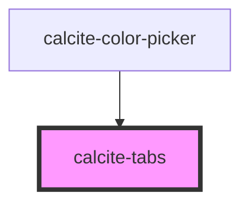

# calcite-tabs

<!-- Auto Generated Below -->

## Usage

### Basic

`calcite-tabs` uses several sub-components ([calcite-tab-nav](../tab-nav), [calcite-tab](../tab), [calcite-tab-title](../tab-title)) to create a tabbed interface with optional client side storage. Place your content inside of the `<calcite-tab>` element:

```html
<calcite-tabs>
  <calcite-tab-nav slot="title-group">
    <calcite-tab-title selected>Tab 1 Title</calcite-tab-title>
    <calcite-tab-title>Tab 2 Title</calcite-tab-title>
  </calcite-tab-nav>

  <calcite-tab selected>Tab 1 Content</calcite-tab>
  <calcite-tab>Tab 2 Content</calcite-tab>
</calcite-tabs>
```

### Bordered

```html
<calcite-tabs bordered>
  <calcite-tab-nav slot="title-group">
    <calcite-tab-title tab="tab1">Tab 1 Title</calcite-tab-title>
    <calcite-tab-title tab="tab2">Tab 2 Title</calcite-tab-title>
    <calcite-tab-title tab="tab3">Tab 3 Title</calcite-tab-title>
    <calcite-tab-title tab="tab4" selected>Tab 4 Title</calcite-tab-title>
  </calcite-tab-nav>
  <calcite-tab tab="tab1">Tab 1 Content</calcite-tab>
  <calcite-tab tab="tab2">Tab 2 Content</calcite-tab>
  <calcite-tab tab="tab3">Tab 3 Content</calcite-tab>
  <calcite-tab tab="tab4" selected>Tab 4 Content</calcite-tab>
</calcite-tabs>
```

## Properties

| Property   | Attribute  | Description                                                                                                                                        | Type                   | Default    |
| ---------- | ---------- | -------------------------------------------------------------------------------------------------------------------------------------------------- | ---------------------- | ---------- |
| `bordered` | `bordered` | When `true`, the component will display with a folder style menu.                                                                                  | `boolean`              | `false`    |
| `layout`   | `layout`   | Specifies the layout of the `calcite-tab-nav`, justifying the `calcite-tab-title`s to the start (`"inline"`), or across and centered (`"center"`). | `"center" \| "inline"` | `"inline"` |
| `position` | `position` | Specifies the position of the component in relation to the `calcite-tab`s.                                                                         | `"bottom" \| "top"`    | `"top"`    |
| `scale`    | `scale`    | Specifies the size of the component.                                                                                                               | `"l" \| "m" \| "s"`    | `"m"`      |

## Slots

| Slot            | Description                            |
| --------------- | -------------------------------------- |
|                 | A slot for adding `calcite-tab`s.      |
| `"title-group"` | A slot for adding a `calcite-tab-nav`. |

## Dependencies

### Used by

- [calcite-color-picker](../color-picker)

### Graph



---

*Built with [StencilJS](https://stenciljs.com/)*
