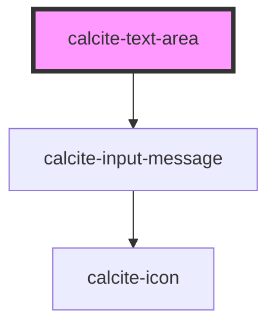

# calcite-text-area

<!-- Auto Generated Below -->

## Usage

### Basic

```html
<calcite-text-area placeholder="Add Notes"></calcite-text-area>
```

### Exceeding-max-length

Renders text-area with character limit counter.

```html
<calcite-text-area placeholder="Add Notes" value="Rocky Mountains National Park" max-length="20"></calcite-text-area>
```

## Properties

| Property            | Attribute            | Description                                                                                                                                                                | Type                                             | Default     |
| ------------------- | -------------------- | -------------------------------------------------------------------------------------------------------------------------------------------------------------------------- | ------------------------------------------------ | ----------- |
| `autofocus`         | `autofocus`          | When `true`, the component is focused on page load. Only one element can contain `autofocus`. If multiple elements have `autofocus`, the first element will receive focus. | `boolean`                                        | `false`     |
| `columns`           | `columns`            | Specifies the component's number of columns.                                                                                                                               | `number`                                         | `undefined` |
| `disabled`          | `disabled`           | When `true`, interaction is prevented and the component is displayed with lower opacity.                                                                                   | `boolean`                                        | `false`     |
| `form`              | `form`               | The `id` of the form that will be associated with the component. When not set, the component will be associated with its ancestor form element, if any.                    | `string`                                         | `undefined` |
| `groupSeparator`    | `group-separator`    | When `true`, number values are displayed with a group separator corresponding to the language and country format.                                                          | `boolean`                                        | `false`     |
| `label`             | `label`              | Accessible name for the component.                                                                                                                                         | `string`                                         | `undefined` |
| `maxLength`         | `max-length`         | Specifies the maximum number of characters allowed.                                                                                                                        | `number`                                         | `undefined` |
| `messageOverrides`  | `message-overrides`  | Use this property to override individual strings used by the component.                                                                                                    | `TextAreaMessages`                               | `undefined` |
| `name`              | `name`               | Specifies the name of the component.                                                                                                                                       | `string`                                         | `undefined` |
| `numberingSystem`   | `numbering-system`   | Specifies the Unicode numeral system used by the component for localization.                                                                                               | `"arab" \| "arabext" \| "latn"`                  | `undefined` |
| `placeholder`       | `placeholder`        | Specifies the placeholder text for the component.                                                                                                                          | `string`                                         | `undefined` |
| `readOnly`          | `read-only`          | When `true`, the component's `value` can be read, but cannot be modified.                                                                                                  | `boolean`                                        | `false`     |
| `required`          | `required`           | When `true`, the component must have a value in order for the form to submit.                                                                                              | `boolean`                                        | `false`     |
| `resize`            | `resize`             | Specifies if the component is resizable.                                                                                                                                   | `"both" \| "horizontal" \| "none" \| "vertical"` | `"both"`    |
| `rows`              | `rows`               | Specifies the component's number of rows.                                                                                                                                  | `number`                                         | `undefined` |
| `scale`             | `scale`              | Specifies the size of the component.                                                                                                                                       | `"l" \| "m" \| "s"`                              | `"m"`       |
| `status`            | `status`             | Specifies the status of the input field, which determines message and icons.                                                                                               | `"idle" \| "invalid" \| "valid"`                 | `"idle"`    |
| `validationIcon`    | `validation-icon`    | Specifies the validation icon to display under the component.                                                                                                              | `boolean \| string`                              | `undefined` |
| `validationMessage` | `validation-message` | Specifies the validation message to display under the component.                                                                                                           | `string`                                         | `undefined` |
| `value`             | `value`              | The component's value.                                                                                                                                                     | `string`                                         | `undefined` |
| `wrap`              | `wrap`               | Specifies the wrapping mechanism for the text.                                                                                                                             | `"hard" \| "soft"`                               | `"soft"`    |

## Events

| Event                   | Description                                           | Type                |
| ----------------------- | ----------------------------------------------------- | ------------------- |
| `calciteTextAreaChange` | Fires each time a new `value` is typed and committed. | `CustomEvent<void>` |
| `calciteTextAreaInput`  | Fires each time a new `value` is typed.               | `CustomEvent<void>` |

## Methods

### `selectText() => Promise<void>`

Selects the text of the component's `value`.

#### Returns

Type: `Promise<void>`

### `setFocus() => Promise<void>`

Sets focus on the component.

#### Returns

Type: `Promise<void>`

## Slots

| Slot             | Description                                                       |
| ---------------- | ----------------------------------------------------------------- |
|                  | A slot for adding text.                                           |
| `"footer-end"`   | A slot for adding content to the end of the component's footer.   |
| `"footer-start"` | A slot for adding content to the start of the component's footer. |

## Dependencies

### Depends on

- [calcite-input-message](../input-message)

### Graph



---

*Built with [StencilJS](https://stenciljs.com/)*
