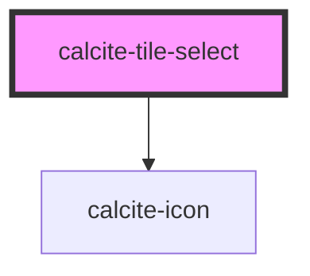

# calcite-tile-select

<!-- Auto Generated Below -->

## Usage

### Basic

```html
<calcite-tile-select
  checked
  input-enabled
  description="Discover new opportunities for growth and success in your industry. Embrace forward-thinking strategies to stay ahead of the competition."
  heading="Innovate for success"
  icon="lightbulb"
  input-alignment="end"
  type="radio"
  value="one"
></calcite-tile-select>
```

## Properties

| Property         | Attribute         | Description                                                                                                                           | Type                    | Default     |
| ---------------- | ----------------- | ------------------------------------------------------------------------------------------------------------------------------------- | ----------------------- | ----------- |
| `checked`        | `checked`         | When `true`, the component is checked.                                                                                                | `boolean`               | `false`     |
| `description`    | `description`     | A description for the component, which displays below the heading.                                                                    | `string`                | `undefined` |
| `disabled`       | `disabled`        | When `true`, interaction is prevented and the component is displayed with lower opacity.                                              | `boolean`               | `false`     |
| `heading`        | `heading`         | The component header text, which displays between the icon and description.                                                           | `string`                | `undefined` |
| `hidden`         | `hidden`          | When `true`, the component is not displayed and is not focusable or checkable.                                                        | `boolean`               | `false`     |
| `icon`           | `icon`            | Specifies an icon to display.                                                                                                         | `string`                | `undefined` |
| `iconFlipRtl`    | `icon-flip-rtl`   | When `true`, the icon will be flipped when the element direction is right-to-left (`"rtl"`).                                          | `boolean`               | `false`     |
| `inputAlignment` | `input-alignment` | When `inputEnabled` is `true`, specifies the placement of the interactive input on the component.                                     | `"end" \| "start"`      | `"start"`   |
| `inputEnabled`   | `input-enabled`   | When `true`, displays an interactive input based on the `type` property.                                                              | `boolean`               | `false`     |
| `name`           | `name`            | Specifies the name of the component on form submission.                                                                               | `any`                   | `undefined` |
| `type`           | `type`            | Specifies the selection mode of the component, where: `"radio"` is for single selection, and `"checkbox"` is for multiple selections. | `"checkbox" \| "radio"` | `"radio"`   |
| `value`          | `value`           | The component's value.                                                                                                                | `any`                   | `undefined` |
| `width`          | `width`           | Specifies the width of the component.                                                                                                 | `"auto" \| "full"`      | `"auto"`    |

## Events

| Event                     | Description                                                                                                            | Type                |
| ------------------------- | ---------------------------------------------------------------------------------------------------------------------- | ------------------- |
| `calciteTileSelectChange` | Emits a custom change event. For checkboxes it emits when checked or unchecked. For radios it only emits when checked. | `CustomEvent<void>` |

## Methods

### `setFocus() => Promise<void>`

Sets focus on the component.

#### Returns

Type: `Promise<void>`

## Slots

| Slot | Description                       |
| ---- | --------------------------------- |
|      | A slot for adding custom content. |

## Dependencies

### Depends on

- [calcite-icon](../icon)

### Graph



---

*Built with [StencilJS](https://stenciljs.com/)*
