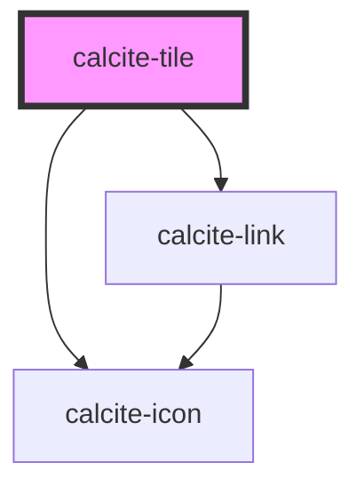

# calcite-tile

<!-- Auto Generated Below -->

## Usage

### Basic

```html
<calcite-tile
  description="Explore a curated collection of high-quality images and visuals. Find inspiration for your projects and discover the beauty of photography."
  heading="Discover stunning images"
  href="#"
  icon="images"
></calcite-tile>
```

## Properties

| Property      | Attribute       | Description                                                                                                | Type                  | Default     |
| ------------- | --------------- | ---------------------------------------------------------------------------------------------------------- | --------------------- | ----------- |
| `active`      | `active`        | When `true`, the component is active.                                                                      | `boolean`             | `false`     |
| `alignment`   | `alignment`     | Specifies the alignment of the Tile's content.                                                             | `"center" \| "start"` | `"start"`   |
| `description` | `description`   | A description for the component, which displays below the heading.                                         | `string`              | `undefined` |
| `disabled`    | `disabled`      | When `true`, interaction is prevented and the component is displayed with lower opacity.                   | `boolean`             | `false`     |
| `embed`       | `embed`         | The component's embed mode. When `true`, renders without a border and padding for use by other components. | `boolean`             | `false`     |
| `heading`     | `heading`       | The component header text, which displays between the icon and description.                                | `string`              | `undefined` |
| `href`        | `href`          | When embed is `"false"`, the URL for the component.                                                        | `string`              | `undefined` |
| `icon`        | `icon`          | Specifies an icon to display.                                                                              | `string`              | `undefined` |
| `iconFlipRtl` | `icon-flip-rtl` | When `true`, the icon will be flipped when the element direction is right-to-left (`"rtl"`).               | `boolean`             | `false`     |
| `scale`       | `scale`         | Specifies the size of the component.                                                                       | `"l" \| "m" \| "s"`   | `"m"`       |

## Slots

| Slot              | Description                                                               |
| ----------------- | ------------------------------------------------------------------------- |
| `"content-end"`   | A slot for adding non-actionable elements after the component's content.  |
| `"content-start"` | A slot for adding non-actionable elements before the component's content. |

## CSS Custom Properties

| Name                                          | Description                                                                             |
| --------------------------------------------- | --------------------------------------------------------------------------------------- |
| `--calcite-tile-background-color`             | Specifies the background color of the component.                                        |
| `--calcite-tile-border-color`                 | Specifies the border color of the component.                                            |
| `--calcite-tile-border-color-active`          | Specifies the border color of the component when in an active state.                    |
| `--calcite-tile-border-color-hover`           | Specifies the border color of the component when in a hover state.                      |
| `--calcite-tile-description-text-color`       | Specifies the description text color of the component.                                  |
| `--calcite-tile-description-text-color-hover` | Specifies the description text color of the component when in an active or hover state. |
| `--calcite-tile-heading-text-color`           | Specifies the heading text color of the component.                                      |
| `--calcite-tile-heading-text-color-hover`     | Specifies the heading text color of the component when in an active or hover state.     |
| `--calcite-tile-icon-color`                   | Specifies the icon color of the component.                                              |

## Dependencies

### Depends on

- [calcite-icon](../icon)
- [calcite-link](../link)

### Graph



---

*Built with [StencilJS](https://stenciljs.com/)*
