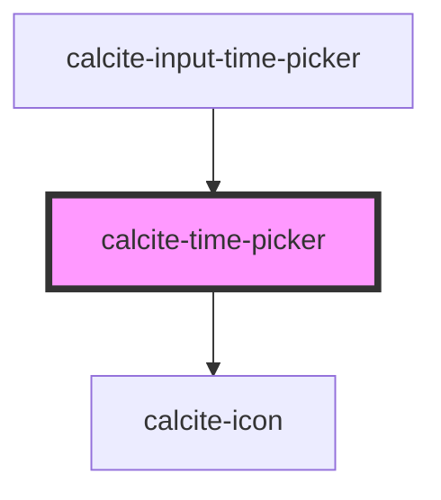

# calcite-time-picker

<!-- Auto Generated Below -->

## Properties

| Property           | Attribute          | Description                                                                  | Type                                                                                                                                                                                                                                                                                                                             | Default     |
| ------------------ | ------------------ | ---------------------------------------------------------------------------- | -------------------------------------------------------------------------------------------------------------------------------------------------------------------------------------------------------------------------------------------------------------------------------------------------------------------------------- | ----------- |
| `messageOverrides` | --                 | Use this property to override individual strings used by the component.      | `{ fractionalSecond?: string; fractionalSecondDown?: string; fractionalSecondUp?: string; hour?: string; hourDown?: string; hourUp?: string; meridiem?: string; meridiemDown?: string; meridiemUp?: string; minute?: string; minuteDown?: string; minuteUp?: string; second?: string; secondDown?: string; secondUp?: string; }` | `undefined` |
| `numberingSystem`  | `numbering-system` | Specifies the Unicode numeral system used by the component for localization. | `"arab" \| "arabext" \| "bali" \| "beng" \| "deva" \| "fullwide" \| "gujr" \| "guru" \| "hanidec" \| "khmr" \| "knda" \| "laoo" \| "latn" \| "limb" \| "mlym" \| "mong" \| "mymr" \| "orya" \| "tamldec" \| "telu" \| "thai" \| "tibt"`                                                                                          | `undefined` |
| `scale`            | `scale`            | Specifies the size of the component.                                         | `"l" \| "m" \| "s"`                                                                                                                                                                                                                                                                                                              | `"m"`       |
| `step`             | `step`             | Specifies the granularity the `value` must adhere to (in seconds).           | `number`                                                                                                                                                                                                                                                                                                                         | `60`        |
| `value`            | `value`            | The component's value in UTC (always 24-hour format).                        | `string`                                                                                                                                                                                                                                                                                                                         | `null`      |

## Methods

### `setFocus() => Promise<void>`

Sets focus on the component's first focusable element.

#### Returns

Type: `Promise<void>`

## Dependencies

### Used by

- [calcite-input-time-picker](../input-time-picker)

### Depends on

- [calcite-icon](../icon)

### Graph

---

_Built with [StencilJS](https://stenciljs.com/)_
