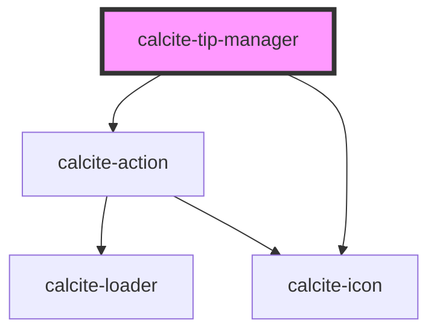

# calcite-tip-manager

The `calcite-tip-manager` component contains multiple `calcite-tip`s that a user can view through via interactive arrows to go back and forth through the tips in the deck.

<!-- Auto Generated Below -->

## Usage

### Basic

Renders a tip manager using a group of tips as well as a single tip.

```html
<calcite-tip-manager>
  <calcite-tip-group group-title="Animal Insights">
    <calcite-tip heading="Paws for Thought" selected>
      
      <p>
        Did you know that a dog's sense of smell is so powerful that it can detect certain diseases, including cancer,
        with remarkable accuracy?
      </p>
      <p>
        Explore the incredible abilities of dogs with our
        <calcite-link href="#" target="_blank" rel="noopener noreferrer">Canine Marvels</calcite-link>.
      </p>
    </calcite-tip>
    <calcite-tip heading="Whisker Wisdom" hidden>
      
      <p>
        Cats use their whiskers not only for balance but also to measure openings. If a cat's whiskers fit through an
        opening, the rest of its body will too!
      </p>
      <p>
        Discover intriguing facts about cats with our
        <calcite-link href="#" target="_blank" rel="noopener noreferrer">Curious Cat Chronicles</calcite-link>.
      </p>
    </calcite-tip>
  </calcite-tip-group>
  <calcite-tip heading="Bear Essentials" hidden>
    
    <p>
      Bears are excellent swimmers! They can swim long distances and even dive for their meals. Polar bears, in
      particular, are known to swim for hours in search of food.
    </p>
    <p>
      Explore the aquatic side of bears with our
      <calcite-link href="#" target="_blank" rel="noopener noreferrer">Bear Aquatics</calcite-link>.
    </p>
  </calcite-tip>
</calcite-tip-manager>
```

## Properties

| Property           | Attribute       | Description                                                             | Type                                                                                                                 | Default     |
| ------------------ | --------------- | ----------------------------------------------------------------------- | -------------------------------------------------------------------------------------------------------------------- | ----------- |
| `closed`           | `closed`        | When `true`, does not display or position the component.                | `boolean`                                                                                                            | `false`     |
| `headingLevel`     | `heading-level` | Specifies the number at which section headings should start.            | `1 \| 2 \| 3 \| 4 \| 5 \| 6`                                                                                         | `undefined` |
| `messageOverrides` | --              | Use this property to override individual strings used by the component. | `{ defaultGroupTitle?: string; defaultPaginationLabel?: string; close?: string; previous?: string; next?: string; }` | `undefined` |

## Events

| Event                    | Description                               | Type                |
| ------------------------ | ----------------------------------------- | ------------------- |
| `calciteTipManagerClose` | Emits when the component has been closed. | `CustomEvent<void>` |

## Methods

### `nextTip() => Promise<void>`

Selects the next `calcite-tip` to display.

#### Returns

Type: `Promise<void>`

### `previousTip() => Promise<void>`

Selects the previous `calcite-tip` to display.

#### Returns

Type: `Promise<void>`

## Slots

| Slot | Description                       |
| ---- | --------------------------------- |
|      | A slot for adding `calcite-tip`s. |

## CSS Custom Properties

| Name                           | Description                                                        |
| ------------------------------ | ------------------------------------------------------------------ |
| `--calcite-tip-manager-height` | The maximum height of the component.                               |
| `--calcite-tip-max-width`      | The maximum width of a slotted `calcite-tip` within the component. |

## Dependencies

### Depends on

- [calcite-action](../action)
- [calcite-icon](../icon)

### Graph



---

*Built with [StencilJS](https://stenciljs.com/)*
