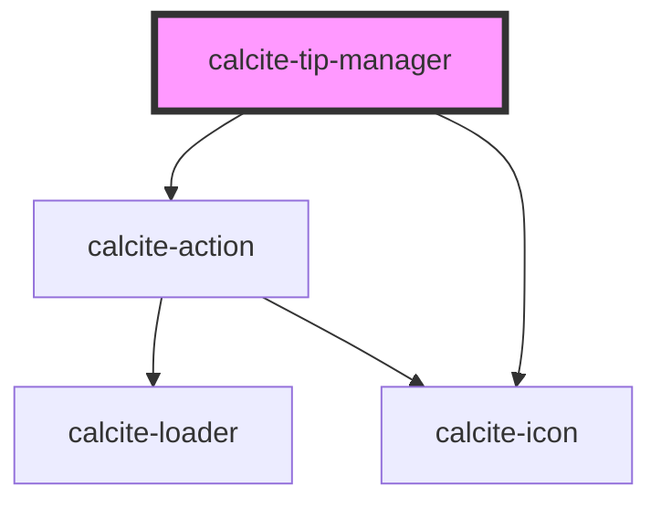

# calcite-tip-manager

For comprehensive guidance on using and implementing `calcite-tip-manager`, refer to the [documentation page](https://developers.arcgis.com/calcite-design-system/components/tip-manager/).

<!-- Auto Generated Below -->

> **[DEPRECATED]** Use the `calcite-carousel` and `calcite-carousel-item` components instead.

## Properties

| Property           | Attribute           | Description                                                                                                               | Type                         | Default     |
| ------------------ | ------------------- | ------------------------------------------------------------------------------------------------------------------------- | ---------------------------- | ----------- |
| `closed`           | `closed`            | When `true`, does not display or position the component.                                                                  | `boolean`                    | `false`     |
| `headingLevel`     | `heading-level`     | Specifies the heading level of the component's `heading` for proper document structure, without affecting visual styling. | `1 \| 2 \| 3 \| 4 \| 5 \| 6` | `undefined` |
| `messageOverrides` | `message-overrides` | Use this property to override individual strings used by the component.                                                   | `TipManagerMessages`         | `undefined` |

## Events

| Event                    | Description                               | Type                |
| ------------------------ | ----------------------------------------- | ------------------- |
| `calciteTipManagerClose` | Emits when the component has been closed. | `CustomEvent<void>` |

## Methods

### `nextTip() => Promise<void>`

Selects the next `calcite-tip` to display.

#### Returns

Type: `Promise<void>`

### `previousTip() => Promise<void>`

Selects the previous `calcite-tip` to display.

#### Returns

Type: `Promise<void>`

## Slots

| Slot | Description                       |
| ---- | --------------------------------- |
|      | A slot for adding `calcite-tip`s. |

## CSS Custom Properties

| Name                           | Description                                                        |
| ------------------------------ | ------------------------------------------------------------------ |
| `--calcite-tip-manager-height` | The maximum height of the component.                               |
| `--calcite-tip-max-width`      | The maximum width of a slotted `calcite-tip` within the component. |

## Dependencies

### Depends on

- [calcite-action](../action)
- [calcite-icon](../icon)

### Graph

---

*Built with [StencilJS](https://stenciljs.com/)*
