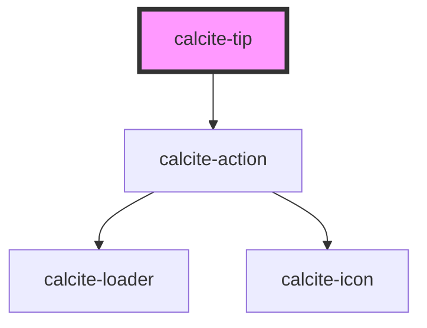

# calcite-tip

The `calcite-tip` component can comprise of an image, text and hyperlink to give helpful hints to a user about using the platform.

<!-- Auto Generated Below -->

## Usage

### Basic

Renders a close-disabled tip with a heading, thumbnail, info and a link.

```html
<calcite-tip close-disabled heading="Kittens">
  
  <p>
    Did you know that kittens are born with their eyes shut and ears folded? They start to open their eyes and unfold
    their ears after about a week.
  </p>
</calcite-tip>
```

## Properties

| Property           | Attribute        | Description                                                                                                                                            | Type                         | Default     |
| ------------------ | ---------------- | ------------------------------------------------------------------------------------------------------------------------------------------------------ | ---------------------------- | ----------- |
| `closeDisabled`    | `close-disabled` | When `true`, the close button is not present on the component.                                                                                         | `boolean`                    | `false`     |
| `closed`           | `closed`         | When `true`, the component does not display.                                                                                                           | `boolean`                    | `false`     |
| `heading`          | `heading`        | The component header text.                                                                                                                             | `string`                     | `undefined` |
| `headingLevel`     | `heading-level`  | Specifies the number at which section headings should start.                                                                                           | `1 \| 2 \| 3 \| 4 \| 5 \| 6` | `undefined` |
| `messageOverrides` | --               | Use this property to override individual strings used by the component.                                                                                | `{ close?: string; }`        | `undefined` |
| `selected`         | `selected`       | When `true`, the component is selected if it has a parent `calcite-tip-manager`. Only one tip can be selected within the `calcite-tip-manager` parent. | `boolean`                    | `false`     |

## Events

| Event               | Description                               | Type                |
| ------------------- | ----------------------------------------- | ------------------- |
| `calciteTipDismiss` | Emits when the component has been closed. | `CustomEvent<void>` |

## Slots

| Slot          | Description                              |
| ------------- | ---------------------------------------- |
|               | A slot for adding text and a hyperlink.  |
| `"thumbnail"` | A slot for adding an HTML image element. |

## CSS Custom Properties

| Name                                           | Description                                                                                           |
| ---------------------------------------------- | ----------------------------------------------------------------------------------------------------- |
| `--calcite-tip-action-background-color`        | defines the background color of an action sub-component inside the component.                         |
| `--calcite-tip-action-background-color-active` | defines the background color of an action sub-component when active inside the component.             |
| `--calcite-tip-action-background-color-hover`  | defines the background color of an action sub-component when hovered or focused inside the component. |
| `--calcite-tip-action-text-color`              | defines the text color of an action sub-component inside the component.                               |
| `--calcite-tip-action-text-color-hover`        | defines the text color of an action sub-component when hovered or focused inside the component.       |
| `--calcite-tip-background-color`               | The background color of the component.                                                                |
| `--calcite-tip-border-color`                   | The border color of the component.                                                                    |
| `--calcite-tip-heading-text-color`             | The heading text color of the component.                                                              |
| `--calcite-tip-slotted-link-text-color`        | The text color of the slotted link.                                                                   |
| `--calcite-tip-text-color`                     | The text color of the component.                                                                      |

## Dependencies

### Depends on

- [calcite-action](../action)

### Graph



---

*Built with [StencilJS](https://stenciljs.com/)*
