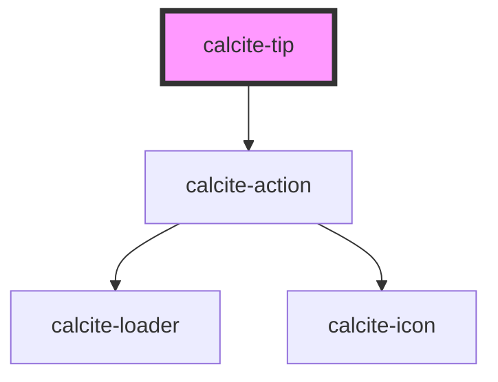

# calcite-tip

For comprehensive guidance on using and implementing `calcite-tip`, refer to the [documentation page](https://developers.arcgis.com/calcite-design-system/components/tip/).

<!-- Auto Generated Below -->

> **[DEPRECATED]** Use the `calcite-card`, `calcite-notice`, `calcite-panel`, or `calcite-tile` component instead.

## Properties

| Property           | Attribute           | Description                                                                                                                                            | Type                         | Default     |
| ------------------ | ------------------- | ------------------------------------------------------------------------------------------------------------------------------------------------------ | ---------------------------- | ----------- |
| `closeDisabled`    | `close-disabled`    | When `true`, the close button is not present on the component.                                                                                         | `boolean`                    | `false`     |
| `closed`           | `closed`            | When `true`, the component does not display.                                                                                                           | `boolean`                    | `false`     |
| `heading`          | `heading`           | The component header text.                                                                                                                             | `string`                     | `undefined` |
| `headingLevel`     | `heading-level`     | Specifies the heading level of the component's `heading` for proper document structure, without affecting visual styling.                              | `1 \| 2 \| 3 \| 4 \| 5 \| 6` | `undefined` |
| `messageOverrides` | `message-overrides` | Use this property to override individual strings used by the component.                                                                                | `TipMessages`                | `undefined` |
| `selected`         | `selected`          | When `true`, the component is selected if it has a parent `calcite-tip-manager`. Only one tip can be selected within the `calcite-tip-manager` parent. | `boolean`                    | `false`     |

## Events

| Event               | Description                               | Type                |
| ------------------- | ----------------------------------------- | ------------------- |
| `calciteTipDismiss` | Emits when the component has been closed. | `CustomEvent<void>` |

## Slots

| Slot          | Description                              |
| ------------- | ---------------------------------------- |
|               | A slot for adding text and a hyperlink.  |
| `"thumbnail"` | A slot for adding an HTML image element. |

## Dependencies

### Depends on

- [calcite-action](../action)

### Graph

---

*Built with [StencilJS](https://stenciljs.com/)*
