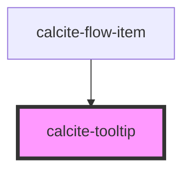

# calcite-tooltip

<!-- Auto Generated Below -->

## Usage

### Basic

```html
<calcite-tooltip placement="auto" reference-element="tooltip-button"
  >This is the message of the tooltip</calcite-tooltip
>
<span>
  Lorem <a id="tooltip-button" href="#">ipsum</a> dolor sit amet, consectetur adipiscing elit, sed do eiusmod tempor
  incididunt ut labore et dolore magna aliqua.
</span>
```

### Virtual

```html
<!-- virtually positioned tooltip -->
<calcite-tooltip id="virtual-tooltip" open>This is the message of the tooltip</calcite-tooltip>

<script>
  function generateGetBoundingClientRect() {
    return () => ({
      width: 0,
      height: 0,
      top: 100,
      right: 100,
      bottom: 100,
      left: 600,
    });
  }

  const virtualElement = {
    getBoundingClientRect: generateGetBoundingClientRect(),
  };

  const tooltip = document.getElementById("virtual-tooltip");
  tooltip.referenceElement = virtualElement;
</script>
```

## Properties

| Property             | Attribute             | Description                                                                                                                                                                                                                                                                                                                                                                           | Type                                                                                                                                                                                                                                                                                                              | Default                 |
| -------------------- | --------------------- | ------------------------------------------------------------------------------------------------------------------------------------------------------------------------------------------------------------------------------------------------------------------------------------------------------------------------------------------------------------------------------------- | ----------------------------------------------------------------------------------------------------------------------------------------------------------------------------------------------------------------------------------------------------------------------------------------------------------------- | ----------------------- |
| `closeOnClick`       | `close-on-click`      | Closes the component when the `referenceElement` is clicked.                                                                                                                                                                                                                                                                                                                          | `boolean`                                                                                                                                                                                                                                                                                                         | `false`                 |
| `label` _(required)_ | `label`               | Accessible name for the component.                                                                                                                                                                                                                                                                                                                                                    | `string`                                                                                                                                                                                                                                                                                                          | `undefined`             |
| `offsetDistance`     | `offset-distance`     | Offset the position of the component away from the `referenceElement`.                                                                                                                                                                                                                                                                                                                | `number`                                                                                                                                                                                                                                                                                                          | `defaultOffsetDistance` |
| `offsetSkidding`     | `offset-skidding`     | Offset the position of the component along the `referenceElement`.                                                                                                                                                                                                                                                                                                                    | `number`                                                                                                                                                                                                                                                                                                          | `0`                     |
| `open`               | `open`                | When `true`, the component is open.                                                                                                                                                                                                                                                                                                                                                   | `boolean`                                                                                                                                                                                                                                                                                                         | `false`                 |
| `overlayPositioning` | `overlay-positioning` | Determines the type of positioning to use for the overlaid content. Using `"absolute"` will work for most cases. The component will be positioned inside of overflowing parent containers and will affect the container's layout. The `"fixed"` value should be used to escape an overflowing parent container, or when the reference element's `position` CSS property is `"fixed"`. | `"absolute" \| "fixed"`                                                                                                                                                                                                                                                                                           | `"absolute"`            |
| `placement`          | `placement`           | Determines where the component will be positioned relative to the `referenceElement`.                                                                                                                                                                                                                                                                                                 | `"auto" \| "top" \| "left" \| "right" \| "bottom-start" \| "leading-start" \| "bottom" \| "top-start" \| "top-end" \| "left-start" \| "left-end" \| "right-start" \| "right-end" \| "bottom-end" \| "auto-start" \| "auto-end" \| "leading" \| "leading-end" \| "trailing-end" \| "trailing" \| "trailing-start"` | `"auto"`                |
| `referenceElement`   | `reference-element`   | The `referenceElement` to position the component according to its `"placement"` value. Setting to the `HTMLElement` is preferred so the component does not need to query the DOM for the `referenceElement`. However, a string ID of the reference element can be used.                                                                                                               | `Element \| VirtualElement \| string`                                                                                                                                                                                                                                                                             | `undefined`             |

## Events

| Event                       | Description                                                                                              | Type                |
| --------------------------- | -------------------------------------------------------------------------------------------------------- | ------------------- |
| `calciteTooltipBeforeClose` | Fires when the component is requested to be closed and before the closing transition begins.             | `CustomEvent<void>` |
| `calciteTooltipBeforeOpen`  | Fires when the component is added to the DOM but not rendered, and before the opening transition begins. | `CustomEvent<void>` |
| `calciteTooltipClose`       | Fires when the component is closed and animation is complete.                                            | `CustomEvent<void>` |
| `calciteTooltipOpen`        | Fires when the component is open and animation is complete.                                              | `CustomEvent<void>` |

## Methods

### `reposition(delayed?: boolean) => Promise<void>`

Updates the position of the component.

#### Returns

Type: `Promise<void>`

## Slots

| Slot | Description             |
| ---- | ----------------------- |
|      | A slot for adding text. |

## CSS Custom Properties

| Name                        | Description                               |
| --------------------------- | ----------------------------------------- |
| `--calcite-tooltip-z-index` | Sets the z-index value for the component. |

## Dependencies

### Used by

- [calcite-flow-item](../flow-item)

### Graph



---

_Built with [StencilJS](https://stenciljs.com/)_
