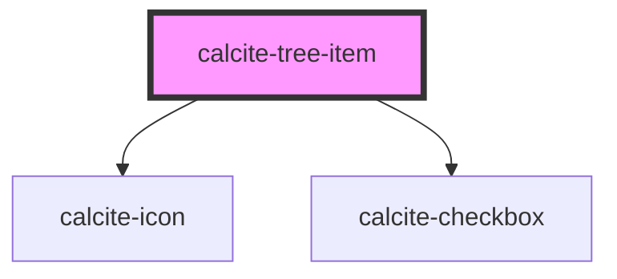

# calcite-tree-item

`<calcite-tree-item>` is used to represent a single item in a `<calcite-tree>`.

<!-- Auto Generated Below -->

## Properties

| Property      | Attribute       | Description                                                                                  | Type                         | Default     |
| ------------- | --------------- | -------------------------------------------------------------------------------------------- | ---------------------------- | ----------- |
| `disabled`    | `disabled`      | When `true`, interaction is prevented and the component is displayed with lower opacity.     | `boolean`                    | `false`     |
| `expanded`    | `expanded`      | When `true`, the component is expanded.                                                      | `boolean`                    | `false`     |
| `iconFlipRtl` | `icon-flip-rtl` | When `true`, the icon will be flipped when the element direction is right-to-left (`"rtl"`). | `"both" \| "end" \| "start"` | `undefined` |
| `iconStart`   | `icon-start`    | Specifies an icon to display at the start of the component.                                  | `string`                     | `undefined` |
| `selected`    | `selected`      | When `true`, the component is selected.                                                      | `boolean`                    | `false`     |

## Slots

| Slot            | Description                                                                                           |
| --------------- | ----------------------------------------------------------------------------------------------------- |
|                 | A slot for adding text.                                                                               |
| `"actions-end"` | A slot for adding actions to the end of the component. It is recommended to use two or fewer actions. |
| `"children"`    | A slot for adding nested `calcite-tree` elements.                                                     |

## CSS Custom Properties

| Name                                                    | Description                                                     |
| ------------------------------------------------------- | --------------------------------------------------------------- |
| `--calcite-tree-item-checkbox-background-color`         | defines the background-color of the sub-component.              |
| `--calcite-tree-item-checkbox-background-color-checked` | defines the background-color of the sub-component when checked. |
| `--calcite-tree-item-checkbox-icon-color`               | defines the checkmark color of the sub-component.               |
| `--calcite-tree-item-checkbox-shadow`                   | defines the shadow of the sub-component.                        |
| `--calcite-tree-item-checkbox-shadow-checked`           | defines the shadow of the sub-component when checked.           |
| `--calcite-tree-item-checkbox-shadow-hover`             | defines the shadow of the sub-component when hovered.           |

## Dependencies

### Depends on

- [calcite-icon](../icon)
- [calcite-checkbox](../checkbox)

### Graph

---

*Built with [StencilJS](https://stenciljs.com/)*
