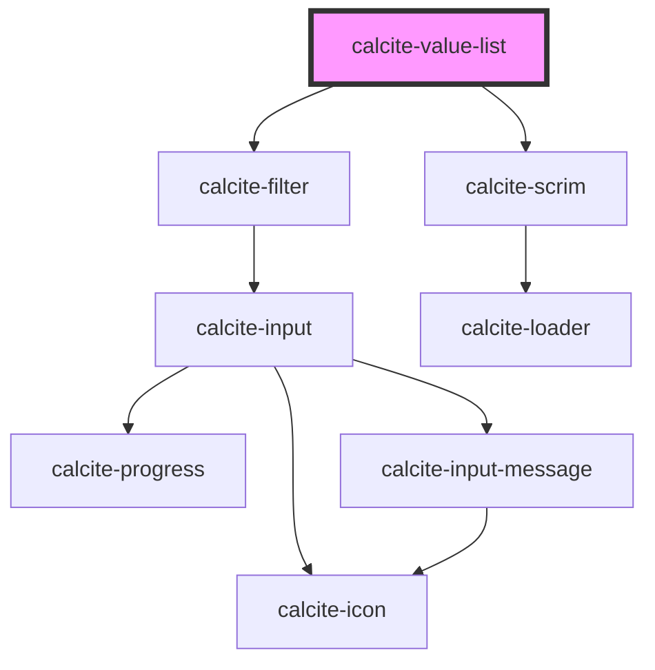

# calcite-value-list

`calcite-value-list` is housed in a panel and contains `calcite-value-list-item`s. The value list has options for drag and drop, label editing, and single or multi-select of items which can be done through shift+click.

<!-- Auto Generated Below -->

> **[DEPRECATED]** Use the `list` component instead.

## Usage

### Basic

Renders a value list with multiple items able to be selected and a filter.

```html
<calcite-value-list multiple filter-enabled>
  <calcite-value-list-item label="Dogs" description="Man's best friend" value="dogs">
    <calcite-action slot="actions-end" icon="plus"></calcite-action>
  </calcite-value-list-item>
  <calcite-value-list-item label="Cats" description="Independent and fluffy" value="cats">
    <calcite-action slot="actions-end" icon="plus"></calcite-action>
  </calcite-value-list-item>
  <calcite-value-list-item
    label="Fish. But not just any fish, a tiger fish caught live in the Atlantic Ocean while on vacation."
    description="Easy to care for."
    value="fish"
  >
    <calcite-action slot="actions-end" icon="plus"></calcite-action>
  </calcite-value-list-item>
</calcite-value-list>
```

### Drag-and-drop

Renders a value list with drag and drop capability between the items.

```html
<calcite-value-list drag-enabled>
  <calcite-value-list-item label="Rent" description="Mortgage + housing costs" value="rent"> </calcite-value-list-item>
  <calcite-value-list-item label="Food" description="its what you eat." value="food"> </calcite-value-list-item>
  <calcite-value-list-item label="Utilities" value="utilities"> </calcite-value-list-item>
  <calcite-value-list-item label="Entertainment" description="Toys and leisure" value="entertainment">
  </calcite-value-list-item>
</calcite-value-list>
```

## Properties

| Property                | Attribute                 | Description                                                                                                                                                                                                                                                             | Type                                                                                          | Default     |
| ----------------------- | ------------------------- | ----------------------------------------------------------------------------------------------------------------------------------------------------------------------------------------------------------------------------------------------------------------------- | --------------------------------------------------------------------------------------------- | ----------- |
| `canPull`               | --                        | When provided, the method will be called to determine whether the element can move from the list.                                                                                                                                                                       | `(detail: DragDetail) => boolean`                                                             | `undefined` |
| `canPut`                | --                        | When provided, the method will be called to determine whether the element can be added from another list.                                                                                                                                                               | `(detail: DragDetail) => boolean`                                                             | `undefined` |
| `disabled`              | `disabled`                | When `true`, interaction is prevented and the component is displayed with lower opacity.                                                                                                                                                                                | `boolean`                                                                                     | `false`     |
| `dragEnabled`           | `drag-enabled`            | When `true`, `calcite-value-list-item`s are sortable via a draggable button.                                                                                                                                                                                            | `boolean`                                                                                     | `false`     |
| `filterEnabled`         | `filter-enabled`          | When `true`, an input appears at the top of the component that can be used by end users to filter list items.                                                                                                                                                           | `boolean`                                                                                     | `false`     |
| `filterPlaceholder`     | `filter-placeholder`      | Placeholder text for the filter's input field.                                                                                                                                                                                                                          | `string`                                                                                      | `undefined` |
| `filterText`            | `filter-text`             | Text for the filter input field.                                                                                                                                                                                                                                        | `string`                                                                                      | `undefined` |
| `filteredData`          | --                        | The currently filtered data.                                                                                                                                                                                                                                            | `{ label: string; description: string; metadata: Record<string, unknown>; value: string; }[]` | `[]`        |
| `filteredItems`         | --                        | The currently filtered items.                                                                                                                                                                                                                                           | `HTMLCalciteValueListItemElement[]`                                                           | `[]`        |
| `group`                 | `group`                   | The component's group identifier. To drag elements from one list into another, both lists must have the same group value.                                                                                                                                               | `string`                                                                                      | `undefined` |
| `loading`               | `loading`                 | When `true`, a busy indicator is displayed.                                                                                                                                                                                                                             | `boolean`                                                                                     | `false`     |
| `messageOverrides`      | `message-overrides`       | Use this property to override individual strings used by the component.                                                                                                                                                                                                 | `ValueListMessages`                                                                           | `undefined` |
| `multiple`              | `multiple`                | Similar to standard radio buttons and checkboxes. When `true`, a user can select multiple `calcite-value-list-item`s at a time. When `false`, only a single `calcite-value-list-item` can be selected at a time, and a new selection will deselect previous selections. | `boolean`                                                                                     | `false`     |
| `selectionFollowsFocus` | `selection-follows-focus` | When `true` and single-selection is enabled, the selection changes when navigating `calcite-value-list-item`s via keyboard.                                                                                                                                             | `boolean`                                                                                     | `false`     |

## Events

| Event                    | Description                                              | Type                                                        |
| ------------------------ | -------------------------------------------------------- | ----------------------------------------------------------- |
| `calciteListChange`      | Emits when any of the list item selections have changed. | `CustomEvent<Map<string, HTMLCalciteValueListItemElement>>` |
| `calciteListFilter`      | Emits when a filter has changed.                         | `CustomEvent<void>`                                         |
| `calciteListOrderChange` | Emits when the order of the list has changed.            | `CustomEvent<any[]>`                                        |

## Methods

### `getSelectedItems() => Promise<Map<string, HTMLCalciteValueListItemElement>>`

Returns the component's selected items.

#### Returns

Type: `Promise<Map<string, HTMLCalciteValueListItemElement>>`

### `setFocus(focusId?: ListFocusId) => Promise<void>`

Sets focus on the component's first focusable element.

#### Parameters

| Name      | Type       | Description |
| --------- | ---------- | ----------- |
| `focusId` | `"filter"` |             |

#### Returns

Type: `Promise<void>`

## Slots

| Slot             | Description                                                                                        |
| ---------------- | -------------------------------------------------------------------------------------------------- |
|                  | A slot for adding `calcite-value-list-item` elements. List items are displayed as a vertical list. |
| `"menu-actions"` | A slot for adding a button and menu combination for performing actions, such as sorting.           |

## Dependencies

### Depends on

- [calcite-filter](../filter)
- [calcite-scrim](../scrim)

### Graph



---

*Built with [StencilJS](https://stenciljs.com/)*
