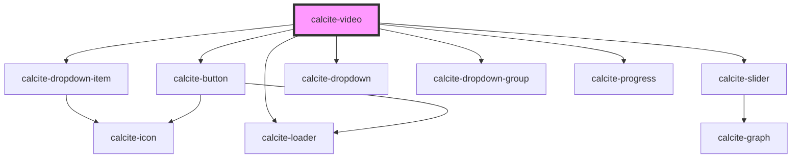

# calcite-video

<calcite-video>
   <source src="video/test.mp4" type="video/mp4">
   <source src="video/test.webm" type="video/webm">
   <track label="English" kind="subtitles" srclang="en" src="captions/vtt/test-en.vtt" default>
   <track label="Deutsch" kind="subtitles" srclang="de" src="captions/vtt/test-de.vtt">
   <track label="Español" kind="subtitles" srclang="es" src="captions/vtt/test-es.vtt">
</calcite-video>

<!-- Auto Generated Below -->

## Properties

| Property              | Attribute                | Description                                          | Type                            | Default                    |
| --------------------- | ------------------------ | ---------------------------------------------------- | ------------------------------- | -------------------------- |
| `autoplay`            | `autoplay`               | autoplay the media                                   | `boolean`                       | `false`                    |
| `disableControls`     | `disable-controls`       | disable controls                                     | `boolean`                       | `false`                    |
| `disableFullscreen`   | `disable-fullscreen`     | is fullscreen mode disabled                          | `boolean`                       | `false`                    |
| `disableProgress`     | `disable-progress`       | disable progress                                     | `boolean`                       | `false`                    |
| `disableScrubbing`    | `disable-scrubbing`      | is scrubbing mode disabled                           | `boolean`                       | `false`                    |
| `disableTimestamp`    | `disable-timestamp`      | disable timestamp                                    | `boolean`                       | `false`                    |
| `height`              | `height`                 | a desired height of the video                        | `string`                        | `undefined`                |
| `intlEnterFullscreen` | `intl-enter-fullscreen`  | string to override English enter fullscreen text     | `string`                        | `TEXT.intlEnterFullscreen` |
| `intlExitFullscreen`  | `intl-exit-fullscreen`   | string to override English exit fullscreen text      | `string`                        | `TEXT.intlExitFullscreen`  |
| `intlMute`            | `intl-mute`              | string to override English mute text                 | `string`                        | `TEXT.intlMute`            |
| `intlPause`           | `intl-pause`             | string to override English pause text                | `string`                        | `TEXT.intlPause`           |
| `intlPlay`            | `intl-play`              | string to override English play text                 | `string`                        | `TEXT.intlPlay`            |
| `intlRestart`         | `intl-restart`           | string to override English restart text              | `string`                        | `TEXT.intlRestart`         |
| `intlSubtitles`       | `intl-subtitles`         | string to override English subtitles text            | `string`                        | `TEXT.intlSubtitles`       |
| `intlUnmute`          | `intl-unmute`            | string to override English unmute text               | `string`                        | `TEXT.intlUnmute`          |
| `loop`                | `loop`                   | loop the media                                       | `boolean`                       | `false`                    |
| `muted`               | `muted`                  | is the media muted                                   | `boolean`                       | `false`                    |
| `playOnHover`         | `play-on-hover`          | allow play on hover                                  | `boolean`                       | `false`                    |
| `preload`             | `preload`                | preload type                                         | `"auto" \| "none" \| "preload"` | `"auto"`                   |
| `scale`               | `scale`                  | specify the scale of the video player, defaults to m | `"l" \| "m" \| "s"`             | `"m"`                      |
| `showControlsOnHover` | `show-controls-on-hover` | show controls on hover                               | `boolean`                       | `false`                    |
| `theme`               | `theme`                  | Select theme (light or dark)                         | `"dark" \| "light"`             | `undefined`                |
| `width`               | `width`                  | a desired width of the video                         | `string`                        | `undefined`                |

## Events

| Event                  | Description | Type               |
| ---------------------- | ----------- | ------------------ |
| `calciteVideoComplete` |             | `CustomEvent<any>` |
| `calciteVideoPause`    |             | `CustomEvent<any>` |
| `calciteVideoPlay`     |             | `CustomEvent<any>` |

## Dependencies

### Depends on

- [calcite-dropdown-item](../calcite-dropdown-item)
- [calcite-button](../calcite-button)
- [calcite-slider](../calcite-slider)
- [calcite-dropdown](../calcite-dropdown)
- [calcite-dropdown-group](../calcite-dropdown-group)
- [calcite-progress](../calcite-progress)
- [calcite-loader](../calcite-loader)

### Graph

---

_Built with [StencilJS](https://stenciljs.com/)_
