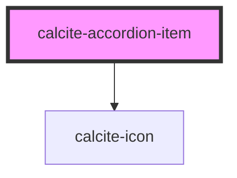

# calcite-accordion-item

individual `calcite-accordion` item

<!-- Auto Generated Below -->

## Properties

| Property       | Attribute       | Description                                                                                                                  | Type      | Default     |
| -------------- | --------------- | ---------------------------------------------------------------------------------------------------------------------------- | --------- | ----------- |
| `active`       | `active`        | **[DEPRECATED]** use `expanded` instead.  When `true`, the component is active.       | `boolean` | `false`     |
| `description`  | `description`   | Specifies a description for the component.                                                                                   | `string`  | `undefined` |
| `expanded`     | `expanded`      | When `true`, the component is expanded.                                                                                      | `boolean` | `false`     |
| `heading`      | `heading`       | Specifies heading text for the component.                                                                                    | `string`  | `undefined` |
| `icon`         | `icon`          | **[DEPRECATED]** use `iconStart` or `iconEnd` instead.  Specifies an icon to display. | `string`  | `undefined` |
| `iconEnd`      | `icon-end`      | Specifies an icon to display at the end of the component.                                                                    | `string`  | `undefined` |
| `iconStart`    | `icon-start`    | Specifies an icon to display at the start of the component.                                                                  | `string`  | `undefined` |
| `itemSubtitle` | `item-subtitle` | **[DEPRECATED]** Use `description` instead.  Specifies a subtitle for the component.  | `string`  | `undefined` |
| `itemTitle`    | `item-title`    | **[DEPRECATED]** Use `heading` instead.  Specifies a title for the component.         | `string`  | `undefined` |

## Slots

| Slot | Description                                                                   |
| ---- | ----------------------------------------------------------------------------- |
|      | A slot for adding custom content, including nested `calcite-accordion-item`s. |

## Dependencies

### Depends on

- [calcite-icon](../icon)

### Graph

---

_Built with [StencilJS](https://stenciljs.com/)_
