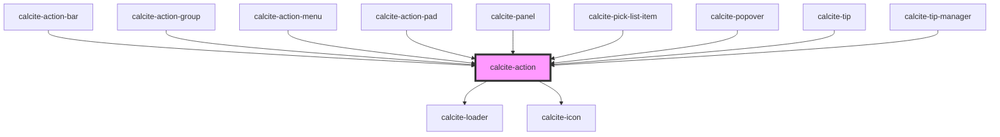

# calcite-action

The `calcite-action` component lives in either a `calcite-action-bar` or `calcite-action-pad`. Actions look like an icon with a text description option of the component that will be revealed when the icon/ text is clicked or selected.

<!-- Auto Generated Below -->

## Usage

### Clear-appearance

Renders a `calcite-action` that has a clear background.

```html
<calcite-action appearance="clear" text="Layers" icon="layers"></calcite-action>
```

### With-text-displayed

Renders a `calcite-action` that displays text along side an icon and a tooltip label.

```html
<calcite-action label="Performs my custom action" text="Perform Action!" text-enabled icon="save"></calcite-action>
```

### Without-text-displayed

Renders a `calcite-action` that displays only an icon and a tooltip label.

```html
<calcite-action label="Performs my custom action" text="My Custom Action" icon="plus"></calcite-action>
```

## Properties

| Property            | Attribute      | Description                                                                                                                           | Type                           | Default        |
| ------------------- | -------------- | ------------------------------------------------------------------------------------------------------------------------------------- | ------------------------------ | -------------- |
| `active`            | `active`       | When true, the component is highlighted.                                                                                              | `boolean`                      | `false`        |
| `alignment`         | `alignment`    | Specifies the horizontal alignment of button elements with text content.                                                              | `"center" \| "end" \| "start"` | `undefined`    |
| `appearance`        | `appearance`   | Specifies the appearance of the component.                                                                                            | `"clear" \| "solid"`           | `"solid"`      |
| `compact`           | `compact`      | When true, the side padding of the component is reduced. Compact mode is used internally by components, e.g. `calcite-block-section`. | `boolean`                      | `false`        |
| `disabled`          | `disabled`     | When true, interaction is prevented and the component is displayed with lower opacity.                                                | `boolean`                      | `false`        |
| `icon`              | `icon`         | Specifies an icon to display - accepts Calcite UI icon names.                                                                         | `string`                       | `undefined`    |
| `indicator`         | `indicator`    | When true, indicates unread changes.                                                                                                  | `boolean`                      | `false`        |
| `intlLoading`       | `intl-loading` | Specifies the text label to display while loading.                                                                                    | `string`                       | `TEXT.loading` |
| `label`             | `label`        | Specifies the label of the component. If no label is provided, the label inherits what's provided for the `text` prop.                | `string`                       | `undefined`    |
| `loading`           | `loading`      | When true, a busy indicator is displayed.                                                                                             | `boolean`                      | `false`        |
| `scale`             | `scale`        | Specifies the size of the component.                                                                                                  | `"l" \| "m" \| "s"`            | `"m"`          |
| `text` _(required)_ | `text`         | Specifies text that accompanies the icon.                                                                                             | `string`                       | `undefined`    |
| `textEnabled`       | `text-enabled` | Indicates whether the text is displayed.                                                                                              | `boolean`                      | `false`        |

## Events

| Event                | Description                                                                                                              | Type                |
| -------------------- | ------------------------------------------------------------------------------------------------------------------------ | ------------------- |
| `calciteActionClick` | <span style="color:red">**[DEPRECATED]**</span> use onClick instead.<br/><br/>Emits when the component has been clicked. | `CustomEvent<void>` |

## Methods

### `setFocus() => Promise<void>`

Sets focus on the component.

#### Returns

Type: `Promise<void>`

## Slots

| Slot | Description                         |
| ---- | ----------------------------------- |
|      | A slot for adding a `calcite-icon`. |

## CSS Custom Properties

| Name                               | Description                                          |
| ---------------------------------- | ---------------------------------------------------- |
| `--calcite-action-indicator-color` | optionally specify the color of the action indicator |

## Dependencies

### Used by

- [calcite-action-bar](../action-bar)
- [calcite-action-group](../action-group)
- [calcite-action-menu](../action-menu)
- [calcite-action-pad](../action-pad)
- [calcite-panel](../panel)
- [calcite-pick-list-item](../pick-list-item)
- [calcite-popover](../popover)
- [calcite-tip](../tip)
- [calcite-tip-manager](../tip-manager)

### Depends on

- [calcite-loader](../loader)
- [calcite-icon](../icon)

### Graph



---

_Built with [StencilJS](https://stenciljs.com/)_
