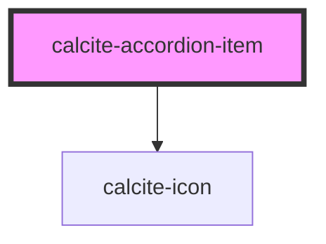

# calcite-accordion-item

individual `calcite-accordion` item

<!-- Auto Generated Below -->

## Properties

| Property    | Attribute    | Description                         | Type      | Default     |
| ----------- | ------------ | ----------------------------------- | --------- | ----------- |
| `active`    | `active`     |                                     | `boolean` | `false`     |
| `itemTitle` | `item-title` | pass a title for the accordion item | `string`  | `undefined` |

## Events

| Event                          | Description | Type               |
| ------------------------------ | ----------- | ------------------ |
| `calciteAccordionItemKeyEvent` |             | `CustomEvent<any>` |
| `calciteAccordionItemSelected` |             | `CustomEvent<any>` |
| `closeCalciteAccordionItem`    |             | `CustomEvent<any>` |
| `registerCalciteAccordionItem` |             | `CustomEvent<any>` |

## Dependencies

### Depends on

- [calcite-icon](../calcite-icon)

### Graph

----------------------------------------------

*Built with [StencilJS](https://stenciljs.com/)*
