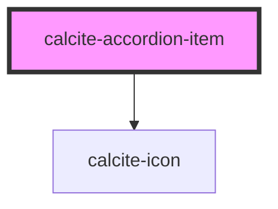

# calcite-accordion-item

individual `calcite-accordion` item

<!-- Auto Generated Below -->

## Properties

| Property       | Attribute       | Description                                                        | Type      | Default     |
| -------------- | --------------- | ------------------------------------------------------------------ | --------- | ----------- |
| `active`       | `active`        | Indicates whether the item is active.                              | `boolean` | `false`     |
| `icon`         | `icon`          | optionally pass an icon to display - accepts Calcite UI icon names | `string`  | `undefined` |
| `itemSubtitle` | `item-subtitle` | pass a title for the accordion item                                | `string`  | `undefined` |
| `itemTitle`    | `item-title`    | pass a title for the accordion item                                | `string`  | `undefined` |

## Slots

| Slot | Description                       |
| ---- | --------------------------------- |
|      | A slot for adding custom content. |

## Dependencies

### Depends on

- [calcite-icon](../calcite-icon)

### Graph

---

_Built with [StencilJS](https://stenciljs.com/)_
