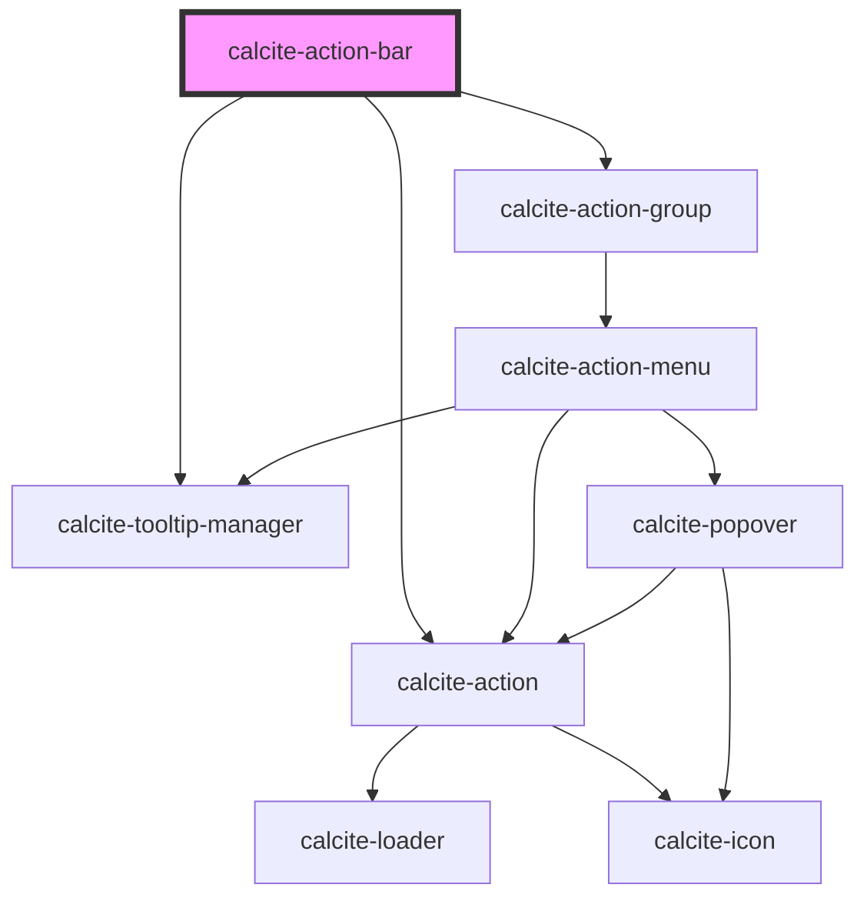

# calcite-action-bar

## Description

The `calcite-action-bar` component is made up of multiple `calcite-action`s in the form of clickable icons. The action bar can be expanded to view actions with descriptive text or made smaller to view with just icons.

<!-- Auto Generated Below -->

## Usage

### Basic

#### Basic Action Bar (Top Actions)

Renders `calcite-action`s that stick to the top of the bar.

```html
<calcite-action-bar>
  <calcite-action text="Add" icon="plus"></calcite-action>
  <calcite-action text="Save" icon="save"></calcite-action>
</calcite-action-bar>
```

#### With grouping

Renders a group of `calcite-action`s contained in a `calcite-action-group`. Actions in a group are visually separated from other groups or actions in the bar.

```html
<calcite-action-bar>
  <calcite-action-group>
    <calcite-action text="Add" icon="plus"></calcite-action>
    <calcite-action text="Save" icon="save"></calcite-action>
  </calcite-action-group>

  <calcite-action-group>
    <calcite-action text="Layers" icon="layers"></calcite-action>
    <calcite-action text="Basemaps" icon="layer-basemap"></calcite-action>
  </calcite-action-group>
</calcite-action-bar>
```

#### Bottom Actions

The bottom-actions slot renders `calcite-action`s that stick to the bottom of the bar above the expand/collapse icon.

```html
<calcite-action-bar>
  <calcite-action text="Information" icon="information"></calcite-action>
  <calcite-action text="Feedback" slot="bottom-actions" icon="mega-phone"></calcite-action>
</calcite-action-bar>
```

### Tooltip

### Tooltip on the expand action

```html
<calcite-action-bar id="action-bar-test">
  <calcite-tooltip slot="expand-tooltip">Expand</calcite-tooltip>
  <calcite-action text="Add" icon="plus"></calcite-action>
</calcite-action-bar>
```

## Properties

| Property                  | Attribute                   | Description                                                              | Type               | Default     |
| ------------------------- | --------------------------- | ------------------------------------------------------------------------ | ------------------ | ----------- |
| `expandDisabled`          | `expand-disabled`           | When set to true, the expand-toggling behavior will be disabled.         | `boolean`          | `false`     |
| `expanded`                | `expanded`                  | Indicates whether widget is expanded.                                    | `boolean`          | `false`     |
| `intlCollapse`            | `intl-collapse`             | Updates the label of the collapse icon when the component is expanded.   | `string`           | `undefined` |
| `intlExpand`              | `intl-expand`               | Updates the label of the expand icon when the component is not expanded. | `string`           | `undefined` |
| `overflowActionsDisabled` | `overflow-actions-disabled` | Disables automatically overflowing actions that won't fit into menus.    | `boolean`          | `undefined` |
| `position`                | `position`                  | Arranges the component depending on the elements 'dir' property.         | `"end" \| "start"` | `undefined` |

## Events

| Event                    | Description                             | Type               |
| ------------------------ | --------------------------------------- | ------------------ |
| `calciteActionBarToggle` | Emitted when expanded has been toggled. | `CustomEvent<any>` |

## Methods

### `setFocus(focusId?: "expand-toggle") => Promise<void>`

#### Returns

Type: `Promise<void>`

## Slots

| Slot               | Description                                                                                                             |
| ------------------ | ----------------------------------------------------------------------------------------------------------------------- |
|                    | A slot for adding `calcite-action`s that will appear at the top of the action bar.                                      |
| `"bottom-actions"` | A slot for adding `calcite-action`s that will appear at the bottom of the action bar, above the collapse/expand button. |
| `"expand-tooltip"` | Used to set the tooltip for the expand toggle.                                                                          |

## Dependencies

### Depends on

- [calcite-action-group](../calcite-action-group)
- [calcite-action](../calcite-action)
- [calcite-tooltip-manager](../calcite-tooltip-manager)

### Graph



---

_Built with [StencilJS](https://stenciljs.com/)_
