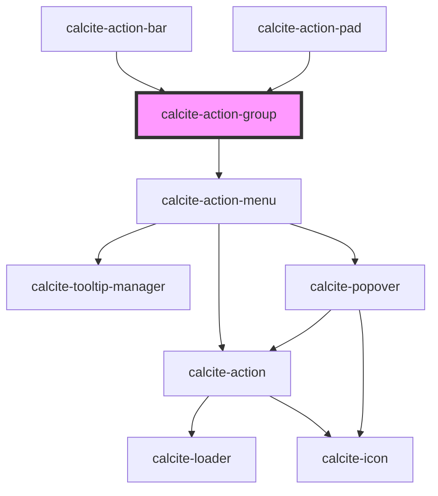

# calcite-action-group

The `calcite-action-group` is a wrapper for multiple `calcite-action`s and housed in `calcite-action-bar` and `calcite-action-pad`.

<!-- Auto Generated Below -->

## Properties

| Property   | Attribute   | Description                                                          | Type                                   | Default      |
| ---------- | ----------- | -------------------------------------------------------------------- | -------------------------------------- | ------------ |
| `columns`  | `columns`   | Indicates number of columns.                                         | `1 \| 2 \| 3 \| 4 \| 5 \| 6`           | `undefined`  |
| `expanded` | `expanded`  | Indicates whether widget is expanded.                                | `boolean`                              | `false`      |
| `intlMore` | `intl-more` | Text string for the actions menu.                                    | `string`                               | `undefined`  |
| `layout`   | `layout`    | Indicates the horizontal, vertical, or grid layout of the component. | `"grid" \| "horizontal" \| "vertical"` | `"vertical"` |
| `menuOpen` | `menu-open` | Opens the action menu.                                               | `boolean`                              | `false`      |

## Slots

| Slot             | Description                                                        |
| ---------------- | ------------------------------------------------------------------ |
|                  | A slot for adding a group of `calcite-action`s.                    |
| `"menu-actions"` | a slot for adding an overflow menu with actions inside a dropdown. |
| `"menu-tooltip"` | a slot for adding an tooltip for the menu.                         |

## Dependencies

### Used by

- [calcite-action-bar](../calcite-action-bar)
- [calcite-action-pad](../calcite-action-pad)

### Depends on

- [calcite-action-menu](../calcite-action-menu)

### Graph

---

_Built with [StencilJS](https://stenciljs.com/)_
