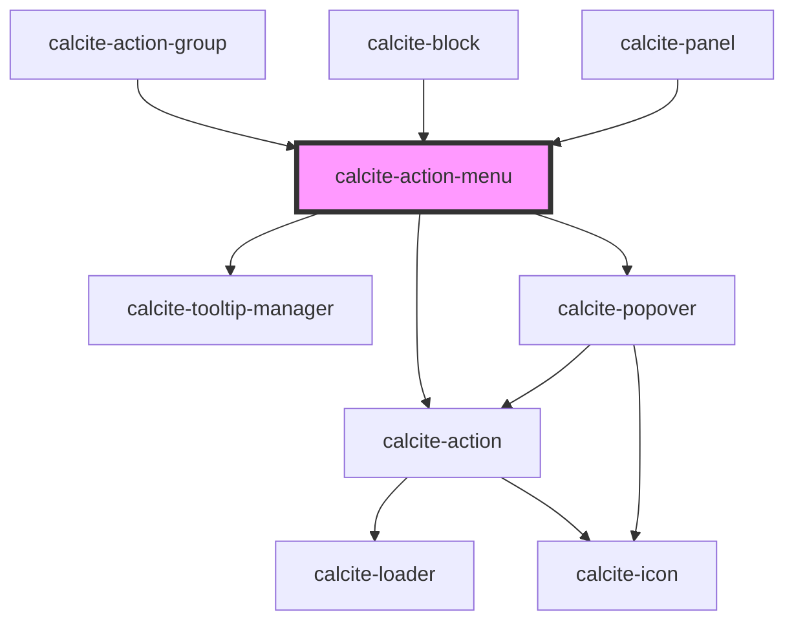

# calcite-action-menu

<!-- Auto Generated Below -->

## Properties

| Property             | Attribute             | Description                                                                                                                        | Type                                        | Default      |
| -------------------- | --------------------- | ---------------------------------------------------------------------------------------------------------------------------------- | ------------------------------------------- | ------------ |
| `expanded`           | `expanded`            | Indicates whether widget is expanded.                                                                                              | `boolean`                                   | `false`      |
| `flipPlacements`     | --                    | Defines the available placements that can be used when a flip occurs.                                                              | `Placement[]`                               | `undefined`  |
| `label` _(required)_ | `label`               | Text string for the actions menu.                                                                                                  | `string`                                    | `undefined`  |
| `open`               | `open`                | Opens the action menu.                                                                                                             | `boolean`                                   | `false`      |
| `overlayPositioning` | `overlay-positioning` | Describes the type of positioning to use for the overlaid content. If your element is in a fixed container, use the 'fixed' value. | `"absolute" \| "fixed"`                     | `"absolute"` |
| `placement`          | `placement`           | Determines where the component will be positioned relative to the referenceElement.                                                | `Placement \| PlacementRtl \| VariationRtl` | `"auto"`     |
| `scale`              | `scale`               | Specifies the size of the menu trigger action.                                                                                     | `"l" \| "m" \| "s"`                         | `undefined`  |

## Events

| Event                         | Description                                 | Type               |
| ----------------------------- | ------------------------------------------- | ------------------ |
| `calciteActionMenuOpenChange` | Emitted when the open property has changed. | `CustomEvent<any>` |

## Methods

### `setFocus() => Promise<void>`

Sets focus on the component.

#### Returns

Type: `Promise<void>`

## Slots

| Slot        | Description                                                       |
| ----------- | ----------------------------------------------------------------- |
|             | A slot for adding `calcite-action`s.                              |
| `"tooltip"` | A slot for adding an tooltip for the menu.                        |
| `"trigger"` | A slot for adding a `calcite-action` to trigger opening the menu. |

## Dependencies

### Used by

- [calcite-action-group](../calcite-action-group)
- [calcite-block](../calcite-block)
- [calcite-panel](../calcite-panel)

### Depends on

- [calcite-action](../calcite-action)
- [calcite-tooltip-manager](../calcite-tooltip-manager)
- [calcite-popover](../calcite-popover)

### Graph

---

_Built with [StencilJS](https://stenciljs.com/)_
