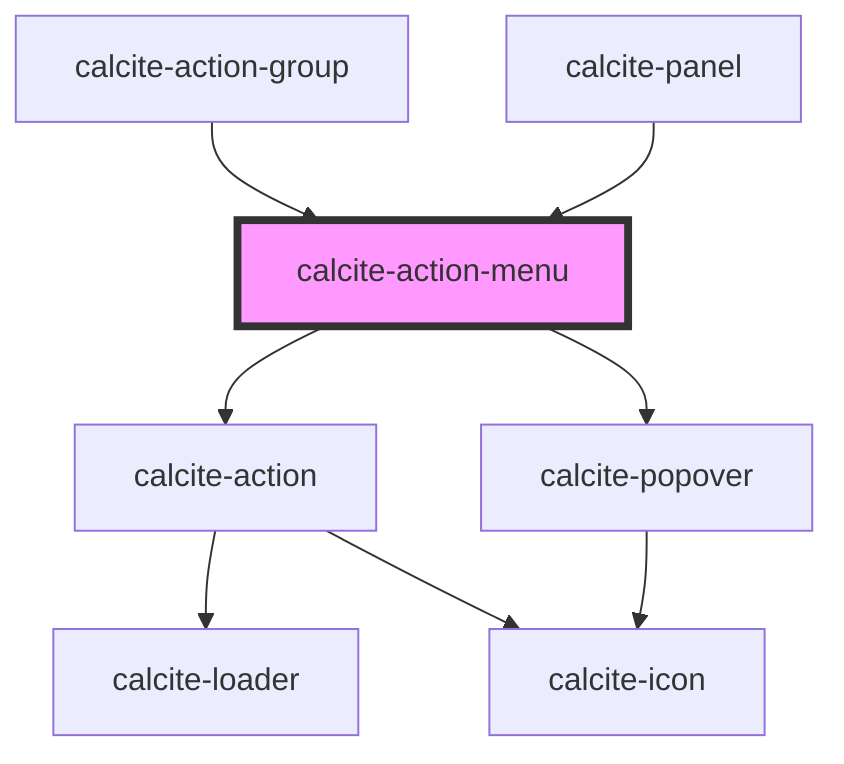

# calcite-action-menu

<!-- Auto Generated Below -->

## Properties

| Property         | Attribute         | Description                                                                         | Type                                                                                                                                                                                                                                                                                                              | Default     |
| ---------------- | ----------------- | ----------------------------------------------------------------------------------- | ----------------------------------------------------------------------------------------------------------------------------------------------------------------------------------------------------------------------------------------------------------------------------------------------------------------- | ----------- |
| `expanded`       | `expanded`        | Indicates whether widget is expanded.                                               | `boolean`                                                                                                                                                                                                                                                                                                         | `false`     |
| `flipPlacements` | --                | Defines the available placements that can be used when a flip occurs.               | `Placement[]`                                                                                                                                                                                                                                                                                                     | `undefined` |
| `intlOptions`    | `intl-options`    | 'Options' text string for the actions menu.                                         | `string`                                                                                                                                                                                                                                                                                                          | `undefined` |
| `offsetDistance` | `offset-distance` | Offset the position of the menu away from the reference element.                    | `number`                                                                                                                                                                                                                                                                                                          | `0`         |
| `open`           | `open`            | Opens the action menu.                                                              | `boolean`                                                                                                                                                                                                                                                                                                         | `false`     |
| `placement`      | `placement`       | Determines where the component will be positioned relative to the referenceElement. | `"auto" \| "auto-start" \| "auto-end" \| "top" \| "bottom" \| "right" \| "left" \| "top-start" \| "top-end" \| "bottom-start" \| "bottom-end" \| "right-start" \| "right-end" \| "left-start" \| "left-end" \| "leading-start" \| "leading" \| "leading-end" \| "trailing-end" \| "trailing" \| "trailing-start"` | `"auto"`    |

## Slots

| Slot | Description                          |
| ---- | ------------------------------------ |
|      | A slot for adding `calcite-action`s. |

## Dependencies

### Used by

- [calcite-action-group](../calcite-action-group)
- [calcite-panel](../calcite-panel)

### Depends on

- [calcite-action](../calcite-action)
- [calcite-popover](../calcite-popover)

### Graph

---

_Built with [StencilJS](https://stenciljs.com/)_
