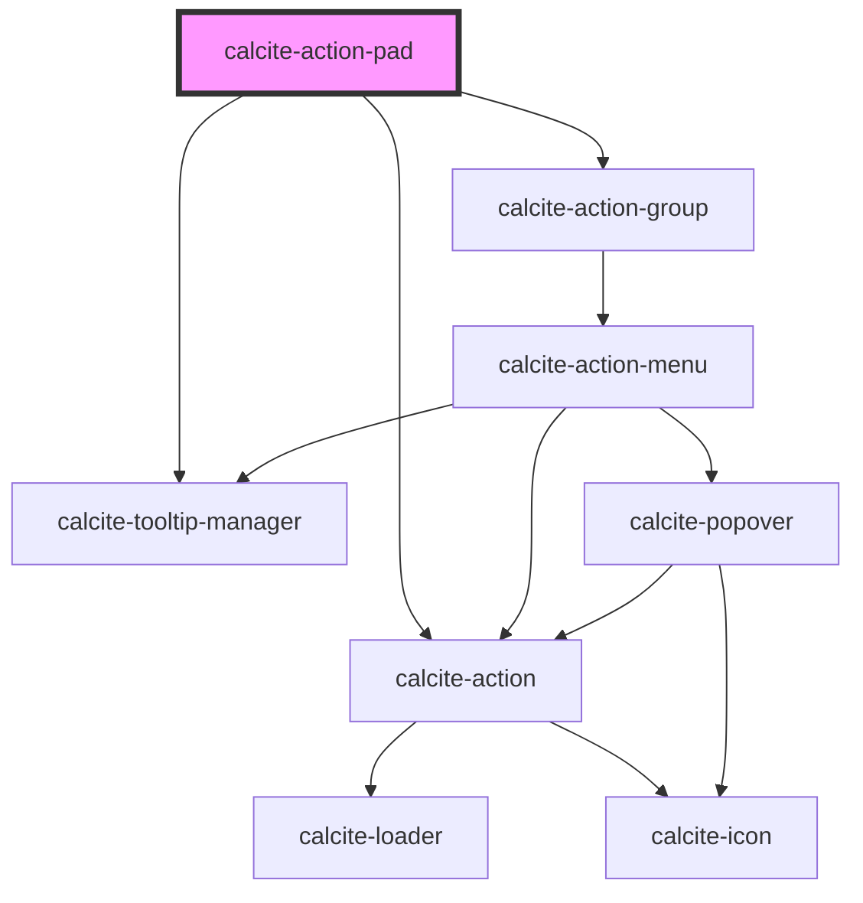

# calcite-action-pad

The `calcite-action-pad` component is made up of `calcite-action`s in the form of clickable icons. This does not have an expandable option and is a smaller and simpler component than `calcite-action-bar`.

<!-- Auto Generated Below -->

## Usage

### Basic

#### Basic Action Pad

Renders a basic action pad with `calcite-action`s.

```html
<calcite-action-pad>
  <calcite-action text="Undo" icon="undo"></calcite-action>
  <calcite-action text="Redo" icon="redo"></calcite-action>
</calcite-action-pad>
```

#### With Grouping

Renders a group of `calcite-action`s contained in a `calcite-action-group`. Actions in a group are visually separated from other groups or actions in the pad.

```html
<calcite-action-pad>
  <calcite-action-group>
    <calcite-action text="Home" icon="home"></calcite-action>
    <calcite-action text="Styles" icon="add-in-edit"></calcite-action>
  </calcite-action-group>

  <calcite-action text="Tips" icon="lightbulb"></calcite-action>
</calcite-action-pad>
```

### Tooltip

### Tooltip on the expand action

```html
<calcite-action-pad id="action-pad-test">
  <calcite-action text="Add" icon="plus"></calcite-action>
</calcite-action-pad>
<calcite-tooltip id="tooltip">Expand</calcite-tooltip>
<script>
  var actionPad = document.getElementById("action-pad-test");
  var tooltip = document.getElementById("tooltip");
  actionPad.tooltipExpand = tooltip;
</script>
```

## Properties

| Property         | Attribute         | Description                                                              | Type                                   | Default      |
| ---------------- | ----------------- | ------------------------------------------------------------------------ | -------------------------------------- | ------------ |
| `expandDisabled` | `expand-disabled` | When set to true, the expand-toggling behavior will be disabled.         | `boolean`                              | `false`      |
| `expanded`       | `expanded`        | Indicates whether widget is expanded.                                    | `boolean`                              | `false`      |
| `intlCollapse`   | `intl-collapse`   | Updates the label of the collapse icon when the component is expanded.   | `string`                               | `undefined`  |
| `intlExpand`     | `intl-expand`     | Updates the label of the expand icon when the component is not expanded. | `string`                               | `undefined`  |
| `layout`         | `layout`          | Indicates the horizontal or vertical layout of the component.            | `"grid" \| "horizontal" \| "vertical"` | `"vertical"` |
| `position`       | `position`        | Arranges the component depending on the elements 'dir' property.         | `"end" \| "start"`                     | `undefined`  |

## Events

| Event                    | Description                             | Type               |
| ------------------------ | --------------------------------------- | ------------------ |
| `calciteActionPadToggle` | Emitted when expanded has been toggled. | `CustomEvent<any>` |

## Methods

### `setFocus(focusId?: "expand-toggle") => Promise<void>`

#### Returns

Type: `Promise<void>`

## Slots

| Slot               | Description                                            |
| ------------------ | ------------------------------------------------------ |
|                    | A slot for adding `calcite-action`s to the action pad. |
| `"expand-tooltip"` | Used to set the tooltip for the expand toggle.         |

## Dependencies

### Depends on

- [calcite-action-group](../calcite-action-group)
- [calcite-action](../calcite-action)
- [calcite-tooltip-manager](../calcite-tooltip-manager)

### Graph



---

_Built with [StencilJS](https://stenciljs.com/)_
