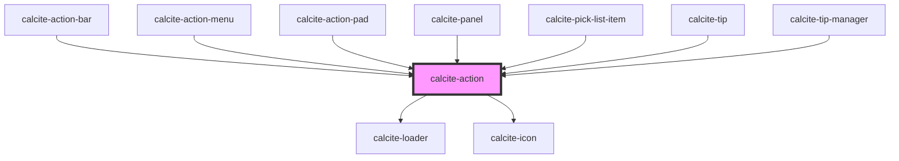

# calcite-action

The `calcite-action` component lives in either a `calcite-action-bar` or `calcite-action-pad`. Actions look like an icon with a text description option of the component that will be revealed when the icon/ text is clicked or selected.

<!-- Auto Generated Below -->

## Usage

### Basic

#### Without text displayed

Renders a `calcite-action` that displays only an icon and a tooltip label.

```html
<calcite-action label="Performs my custom action" text="My Custom Action" icon="plus"></calcite-action>
```

#### With text displayed

Renders a `calcite-action` that displays text along side an icon and a tooltip label.

```html
<calcite-action label="Performs my custom action" text="Perform Action!" text-enabled icon="save"></calcite-action>
```

#### Clear appearance

Renders a `calcite-action` that has a clear background.

```html
<calcite-action appearance="clear" text="Layers" icon="layers"></calcite-action>
```

## Properties

| Property            | Attribute      | Description                                                                                                                         | Type                              | Default        |
| ------------------- | -------------- | ----------------------------------------------------------------------------------------------------------------------------------- | --------------------------------- | -------------- |
| `active`            | `active`       | Indicates whether the action is highlighted.                                                                                        | `boolean`                         | `false`        |
| `alignment`         | `alignment`    | Indicates the alignment when text-enabled is false.                                                                                 | `"center" \| "end" \| "start"`    | `undefined`    |
| `appearance`        | `appearance`   | Specify the appearance style of the action, defaults to solid.                                                                      | `"clear" \| "outline" \| "solid"` | `"solid"`      |
| `compact`           | `compact`      | Compact mode is used internally by components to reduce side padding, e.g. calcite-block-section.                                   | `boolean`                         | `false`        |
| `disabled`          | `disabled`     | When true, disabled prevents interaction. This state shows items with lower opacity/grayed.                                         | `boolean`                         | `false`        |
| `icon`              | `icon`         | The name of the icon to display. The value of this property must match the icon name from https://esri.github.io/calcite-ui-icons/. | `string`                          | `undefined`    |
| `indicator`         | `indicator`    | Indicates unread changes.                                                                                                           | `boolean`                         | `false`        |
| `intlLoading`       | `intl-loading` | string to override English loading text                                                                                             | `string`                          | `TEXT.loading` |
| `label`             | `label`        | The label of the action. If no label is provided, the label inherits what's provided for the `text` prop.                           | `string`                          | `undefined`    |
| `loading`           | `loading`      | When true, content is waiting to be loaded. This state shows a busy indicator.                                                      | `boolean`                         | `false`        |
| `scale`             | `scale`        | Specifies the size of the action.                                                                                                   | `"l" \| "m" \| "s"`               | `"m"`          |
| `text` _(required)_ | `text`         | Text that accompanies the action icon.                                                                                              | `string`                          | `undefined`    |
| `textEnabled`       | `text-enabled` | Indicates whether the text is displayed.                                                                                            | `boolean`                         | `false`        |
| `theme`             | `theme`        | Used to set the component's color scheme.                                                                                           | `"dark" \| "light"`               | `undefined`    |

## Events

| Event                | Description                               | Type               |
| -------------------- | ----------------------------------------- | ------------------ |
| `calciteActionClick` | Emitted when the action has been clicked. | `CustomEvent<any>` |

## Methods

### `setFocus() => Promise<void>`

#### Returns

Type: `Promise<void>`

## Slots

| Slot | Description                         |
| ---- | ----------------------------------- |
|      | A slot for adding a `calcite-icon`. |

## Dependencies

### Used by

- [calcite-action-bar](../calcite-action-bar)
- [calcite-action-menu](../calcite-action-menu)
- [calcite-action-pad](../calcite-action-pad)
- [calcite-panel](../calcite-panel)
- [calcite-pick-list-item](../calcite-pick-list-item)
- [calcite-tip](../calcite-tip)
- [calcite-tip-manager](../calcite-tip-manager)

### Depends on

- [calcite-loader](../calcite-loader)
- [calcite-icon](../calcite-icon)

### Graph



---

_Built with [StencilJS](https://stenciljs.com/)_
