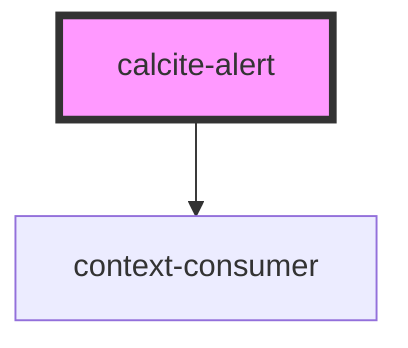

# calcite-alert

Single alert for toast notifications. To position the alert correctly and manage multiple alerts, it's recommended you wrap the alert inside the [calcite-alerts](../calcite-alerts/) component:

```html
<calcite-alerts>
  <calcite-alert>
    <div slot="alert-title">Title of alert</div>
    <div slot="alert-message">
      Message text of the alert
    </div>
    <a slot="alert-link" href="#">Retry</a>
  </calcite-alert>
</calcite-alerts>
```

## TODO

- tests
- verify aria
- document events

<!-- Auto Generated Below -->


## Properties

| Property   | Attribute  | Description                                                                  | Type                                     | Default                                  |
| ---------- | ---------- | ---------------------------------------------------------------------------- | ---------------------------------------- | ---------------------------------------- |
| `color`    | `color`    | Color for the alert (will apply to top border and icon)                      | `"blue" \| "green" \| "red" \| "yellow"` | `"blue"`                                 |
| `dismiss`  | `dismiss`  | Close the alert automatically (recommended for passive, non-blocking alerts) | `boolean`                                | `false`                                  |
| `duration` | `duration` | Length before autodismissal (only used with `dismiss`)                       | `"fast" \| "medium" \| "slow"`           | `this.dismiss     ? "medium"     : null` |
| `icon`     | `icon`     | If false, no icon will be shown in the alert                                 | `boolean`                                | `false`                                  |
| `theme`    | `theme`    | Select theme (light or dark)                                                 | `"dark" \| "light"`                      | `"light"`                                |


## Events

| Event               | Description                   | Type               |
| ------------------- | ----------------------------- | ------------------ |
| `calciteAlertClose` | Fired when an alert is closed | `CustomEvent<any>` |
| `calciteAlertOpen`  | Fired when an alert is opened | `CustomEvent<any>` |


## Methods

### `closeCalciteAlert() => Promise<void>`

emit the `calciteAlertClose` event - <calcite-alerts> listens for this

#### Returns

Type: `Promise<void>`


### `openCalciteAlert() => Promise<void>`

emit the `calciteAlertOpen` event - <calcite-alerts> listens for this

#### Returns

Type: `Promise<void>`


## Slots

| Slot              | Description                                                                  |
| ----------------- | ---------------------------------------------------------------------------- |
| `"alert-link"`    | Optional action to take from the alert (undo, try again, link to page, etc.) |
| `"alert-message"` | Main text of the alert                                                       |
| `"alert-title"`   | Title of the alert (optional)                                                |


## Dependencies

### Depends on

- context-consumer

### Graph


----------------------------------------------

*Built with [StencilJS](https://stenciljs.com/)*
