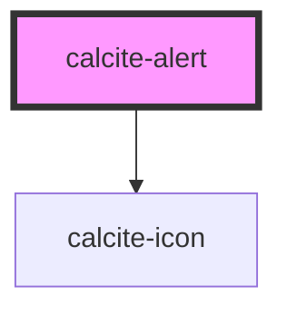

# calcite-alert

A single instance of an alert. Multiple alerts will aggregate in a queue.

```html
  <calcite-alert>
    <div slot="alert-title">Title of alert</div>
    <div slot="alert-message">
      Message text of the alert
    </div>
    <a slot="alert-link" href="#">Retry</a>
  </calcite-alert>
  <calcite-alert>
    <div slot="alert-title">Title of alert</div>
    <div slot="alert-message">
      Message text of the alert
    </div>
    <a slot="alert-link" href="#">Retry</a>
  </calcite-alert>
```

<!-- Auto Generated Below -->


## Properties

| Property              | Attribute               | Description                                                                  | Type                                     | Default                              |
| --------------------- | ----------------------- | ---------------------------------------------------------------------------- | ---------------------------------------- | ------------------------------------ |
| `active`              | `active`                | Is the alert currently active or not                                         | `boolean`                                | `false`                              |
| `alertQueue`          | --                      | a managed list of alerts                                                     | `string[]`                               | `[]`                                 |
| `alertQueueLength`    | `alert-queue-length`    | a managed list of alerts                                                     | `number`                                 | `undefined`                          |
| `autoDismiss`         | `auto-dismiss`          | Close the alert automatically (recommended for passive, non-blocking alerts) | `boolean`                                | `false`                              |
| `autoDismissDuration` | `auto-dismiss-duration` | Duration of autoDismiss (only used with `autoDismiss`)                       | `"fast" \| "medium" \| "slow"`           | `this.autoDismiss ? "medium" : null` |
| `color`               | `color`                 | Color for the alert (will apply to top border and icon)                      | `"blue" \| "green" \| "red" \| "yellow"` | `"blue"`                             |
| `currentAlert`        | `current-alert`         | the determined current alert                                                 | `string`                                 | `undefined`                          |
| `icon`                | `icon`                  | specify if the alert should display an icon                                  | `boolean`                                | `false`                              |
| `scale`               | `scale`                 | specify the scale of the button, defaults to m                               | `"l" \| "m" \| "s"`                      | `"m"`                                |
| `theme`               | `theme`                 | Select theme (light or dark)                                                 | `"dark" \| "light"`                      | `undefined`                          |


## Events

| Event               | Description                   | Type               |
| ------------------- | ----------------------------- | ------------------ |
| `calciteAlertClose` | Fired when an alert is closed | `CustomEvent<any>` |
| `calciteAlertOpen`  | Fired when an alert is opened | `CustomEvent<any>` |
| `calciteAlertSync`  | Fired when an alert is opened | `CustomEvent<any>` |


## Methods

### `close() => Promise<void>`

close alert and emit the closed alert

#### Returns

Type: `Promise<void>`


### `open() => Promise<void>`

open alert and emit the opened alert

#### Returns

Type: `Promise<void>`


### `setFocus() => Promise<void>`

focus the close button, if present and requested

#### Returns

Type: `Promise<void>`


## Slots

| Slot              | Description                                                                  |
| ----------------- | ---------------------------------------------------------------------------- |
| `"alert-link"`    | Optional action to take from the alert (undo, try again, link to page, etc.) |
| `"alert-message"` | Main text of the alert                                                       |
| `"alert-title"`   | Title of the alert (optional)                                                |


## Dependencies

### Depends on

- [calcite-icon](../calcite-icon)

### Graph


----------------------------------------------

*Built with [StencilJS](https://stenciljs.com/)*
