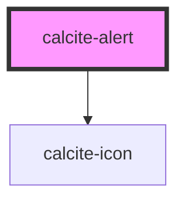

# calcite-alert

<!-- Auto Generated Below -->

## Usage

### Basic

A single instance of an alert. Multiple alerts will aggregate in a queue.

```html
<calcite-alert>
  <div slot="title">Title of alert</div>
  <div slot="alert-message">Message text of the alert</div>
  <a slot="alert-link" href="#">Retry</a>
</calcite-alert>
<calcite-alert>
  <div slot="title">Title of alert</div>
  <div slot="alert-message">Message text of the alert</div>
  <a slot="alert-link" href="#">Retry</a>
</calcite-alert>
```

## Properties

| Property              | Attribute               | Description                                                                                                                                            | Type                                     | Default                              |
| --------------------- | ----------------------- | ------------------------------------------------------------------------------------------------------------------------------------------------------ | ---------------------------------------- | ------------------------------------ |
| `active`              | `active`                | Is the alert currently active or not                                                                                                                   | `boolean`                                | `false`                              |
| `autoDismiss`         | `auto-dismiss`          | Close the alert automatically (recommended for passive, non-blocking alerts)                                                                           | `boolean`                                | `false`                              |
| `autoDismissDuration` | `auto-dismiss-duration` | Duration of autoDismiss (only used with `autoDismiss`)                                                                                                 | `"fast" \| "medium" \| "slow"`           | `this.autoDismiss ? "medium" : null` |
| `color`               | `color`                 | Color for the alert (will apply to top border and icon)                                                                                                | `"blue" \| "green" \| "red" \| "yellow"` | `"blue"`                             |
| `icon`                | `icon`                  | when used as a boolean set to true, show a default recommended icon. You can also pass a calcite-ui-icon name to this prop to display a requested icon | `boolean \| string`                      | `undefined`                          |
| `intlClose`           | `intl-close`            | string to override English close text                                                                                                                  | `string`                                 | `TEXT.intlClose`                     |
| `label` _(required)_  | `label`                 | Accessible name for the component                                                                                                                      | `string`                                 | `undefined`                          |
| `scale`               | `scale`                 | specify the scale of the button, defaults to m                                                                                                         | `"l" \| "m" \| "s"`                      | `"m"`                                |

## Events

| Event               | Description                   | Type               |
| ------------------- | ----------------------------- | ------------------ |
| `calciteAlertClose` | Fired when an alert is closed | `CustomEvent<any>` |
| `calciteAlertOpen`  | Fired when an alert is opened | `CustomEvent<any>` |

## Methods

### `setFocus() => Promise<void>`

focus either the slotted link or the close button

#### Returns

Type: `Promise<void>`

## Slots

| Slot        | Description                                                                  |
| ----------- | ---------------------------------------------------------------------------- |
| `"link"`    | Optional action to take from the alert (undo, try again, link to page, etc.) |
| `"message"` | Main text of the alert                                                       |
| `"title"`   | Title of the alert (optional)                                                |

## Dependencies

### Depends on

- [calcite-icon](../calcite-icon)

### Graph



---

_Built with [StencilJS](https://stenciljs.com/)_
