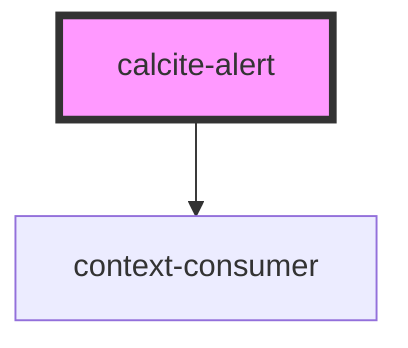

# calcite-alert

Single alert for toast notifications. These will be shown docked to the bottom of the screen and centered. If you may have multiple alerts, it's recommended you use the [calcite-alerts](../calcite-alerts/) component as it can manage several alerts at a time with a queue.

The alert comonent relies on three named slots (title, message, and link) to supply your content:

```html
<calcite-alert>
  <div slot="alert-title">Title of alert</div>
  <div slot="alert-message">
    Message text of the alert
  </div>
  <a slot="alert-link" href="#">Retry</a>
</calcite-alert>
```

## TODO

- tests
- verify aria
- document events

<!-- Auto Generated Below -->


## Properties

| Property   | Attribute  | Description                                                                   | Type                                     | Default    |
| ---------- | ---------- | ----------------------------------------------------------------------------- | ---------------------------------------- | ---------- |
| `color`    | `color`    | Color for the alert (will apply to top border and icon)                       | `"blue" \| "green" \| "red" \| "yellow"` | `'blue'`   |
| `dismiss`  | `dismiss`  | Close the alert automatically (recommended for passive, non-blocking alerts)  | `boolean`                                | `false`    |
| `duration` | `duration` | Length before autodismissal (only used with `dismiss`)                        | `"fast" \| "medium" \| "slow"`           | `'medium'` |
| `icon`     | `icon`     | Optionally specify an icon to use in place of the default success/error icons | `boolean`                                | `false`    |
| `id`       | `id`       | Unique ID for this alert                                                      | `string`                                 | `'1'`      |
| `theme`    | `theme`    | Select theme (light or dark)                                                  | `"dark" \| "light"`                      | `'light'`  |


## Events

| Event        | Description | Type               |
| ------------ | ----------- | ------------------ |
| `alertClose` |             | `CustomEvent<any>` |
| `alertOpen`  |             | `CustomEvent<any>` |


## Methods

### `close() => Promise<void>`

Close the alert and emit the `alertClose` event

#### Returns

Type: `Promise<void>`


## Dependencies

### Depends on

- context-consumer

### Graph


----------------------------------------------

*Built with [StencilJS](https://stenciljs.com/)*
