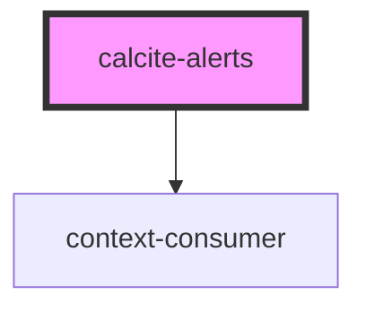

# calcite-alerts

The `calcite-alerts` component is meant to wrap one or multiple [calcite-alert](../calcite-alert) components. If multiple alerts are open it will manage them via a queue. Simply place multiple alerts within the `calcite-alerts` element:

```html
<calcite-alerts>
  <calcite-alert color="red" id="one" dismiss>...</calcite-alert>
  <calcite-alert color="green" id="two">...</calcite-alert>
</calcite-alerts>
```

<!-- Auto Generated Below -->


## Events

| Event                | Description                                                                         | Type               |
| -------------------- | ----------------------------------------------------------------------------------- | ------------------ |
| `calciteAlertsClose` | emits the ID of the alert to be closed, and the current alertQueue and currentAlert | `CustomEvent<any>` |
| `calciteAlertsOpen`  | emits the ID of the alert to be opened, and the current alertQueue and currentAlert | `CustomEvent<any>` |


## Dependencies

### Depends on

- context-consumer

### Graph


----------------------------------------------

*Built with [StencilJS](https://stenciljs.com/)*
