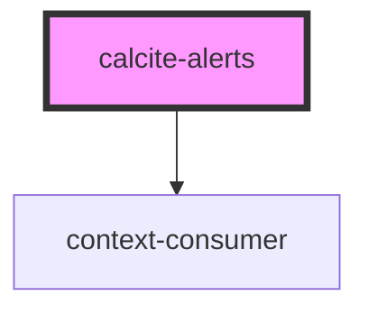

# calcite-alerts

The `calcite-alerts` component is meant to wrap one or multiple [calcite-alert](../calcite-alert) components. If multiple alerts are open it will manage them via a queue. Simply place multiple alerts within the `calcite-alerts` element:

```html
<calcite-alerts>
  <calcite-alert color="red" id="one" dismiss>...</calcite-alert>
  <calcite-alert color="green" id="two">...</calcite-alert>
</calcite-alerts>
```

<!-- Auto Generated Below -->


## Properties

| Property | Attribute | Description                                   | Type     | Default |
| -------- | --------- | --------------------------------------------- | -------- | ------- |
| `id`     | `id`      | Unique ID for this instance of calcite-alerts | `string` | `"1"`   |


## Events

| Event                | Description | Type               |
| -------------------- | ----------- | ------------------ |
| `calciteAlertsClose` |             | `CustomEvent<any>` |
| `calciteAlertsOpen`  |             | `CustomEvent<any>` |


## Dependencies

### Depends on

- context-consumer

### Graph


----------------------------------------------

*Built with [StencilJS](https://stenciljs.com/)*
