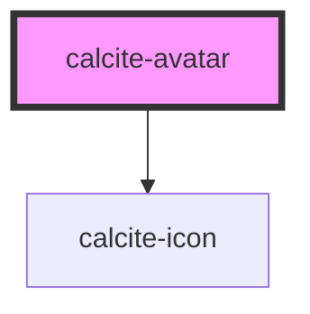

# calcite-avatar

The avatar component provides a unique (but consistent) visual for a user. It's built
to work with users returned from the ArcGIS REST API.

<!-- Auto Generated Below -->

## Properties

| Property    | Attribute   | Description                                                      | Type                | Default     |
| ----------- | ----------- | ---------------------------------------------------------------- | ------------------- | ----------- |
| `fullName`  | `full-name` | full name of the user                                            | `string`            | `undefined` |
| `scale`     | `scale`     | specify the scale of the avatar, defaults to m                   | `"l" \| "m" \| "s"` | `"m"`       |
| `theme`     | `theme`     | Select theme (light or dark)                                     | `"dark" \| "light"` | `undefined` |
| `thumbnail` | `thumbnail` | src to an image (remember to add a token if the user is private) | `string`            | `undefined` |
| `userId`    | `user-id`   | unique id for user                                               | `string`            | `undefined` |
| `username`  | `username`  | user name                                                        | `string`            | `undefined` |

## Dependencies

### Depends on

- [calcite-icon](../calcite-icon)

### Graph

---

_Built with [StencilJS](https://stenciljs.com/)_
