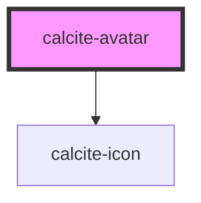

# calcite-button

You can programmatically focus a `calcite-button` with the `setFocus()` method:

`
Focus!
`

<!-- Auto Generated Below -->

## Properties

| Property    | Attribute    | Description                                    | Type                | Default     |
| ----------- | ------------ | ---------------------------------------------- | ------------------- | ----------- |
| `firstName` | `first-name` | first name                                     | `string`            | `undefined` |
| `lastName`  | `last-name`  | last name                                      | `string`            | `undefined` |
| `scale`     | `scale`      | specify the scale of the avatar, defaults to m | `"l" \| "m" \| "s"` | `"m"`       |
| `src`       | `src`        | src to an image                                | `string`            | `undefined` |
| `theme`     | `theme`      | Select theme (light or dark)                   | `"dark" \| "light"` | `"light"`   |

## Dependencies

### Depends on

- [calcite-icon](../calcite-icon)

### Graph

---

_Built with [StencilJS](https://stenciljs.com/)_
