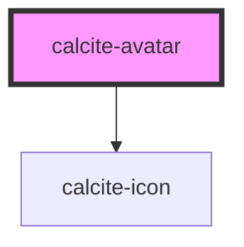

# calcite-avatar

The avatar component provides a unique (but consistent) visual for a user. It's built
to work with users returned from the ArcGIS REST API.

<!-- Auto Generated Below -->

## Usage

### Basic

Take the following sample user returned from a [search for users](https://developers.arcgis.com/rest/users-groups-and-items/user-search.htm):

```json
{
  "username": "ron_swanson_pawnee",
  "id": "a81470986eaeee1833b74b7d8abcd5b2",
  "fullName": "Ron Swanson",
  "firstName": "Ron",
  "lastName": "Swanson",
  "thumbnail": "mySelf.jpg",
  ...
}
```

You can create an avatar for Ron by passing these properties directly to the avatar component, like so:

```html
<calcite-avatar
  username="ron_swanson_pawnee"
  user-id="a81470986eaeee1833b74b7d8abcd5b2"
  full-name="Ron Swanson"
  thumbnail="mySelf.jpg"
/>
```

When no thumbnail is provided, the avatar component will construct a useful placeholder, leveraging the user's information to construct a unique background-color with initials.

**Note:** if your user is private, remember to append a token to the end of the thumbnail using the form `thumbnail.jpg?token=YOUR_LOGGED_IN_USER_TOKEN`.

## Properties

| Property    | Attribute   | Description                                                      | Type                | Default     |
| ----------- | ----------- | ---------------------------------------------------------------- | ------------------- | ----------- |
| `fullName`  | `full-name` | full name of the user                                            | `string`            | `undefined` |
| `scale`     | `scale`     | specify the scale of the avatar, defaults to m                   | `"l" \| "m" \| "s"` | `"m"`       |
| `thumbnail` | `thumbnail` | src to an image (remember to add a token if the user is private) | `string`            | `undefined` |
| `userId`    | `user-id`   | unique id for user                                               | `string`            | `undefined` |
| `username`  | `username`  | user name                                                        | `string`            | `undefined` |

## Dependencies

### Depends on

- [calcite-icon](../calcite-icon)

### Graph



---

_Built with [StencilJS](https://stenciljs.com/)_
