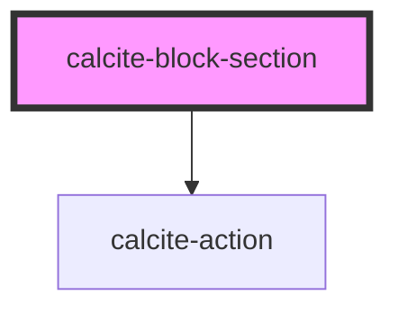

# calcite-block-section

The `calcite-block-section` component is a child element of `calcite-block`. Sections can have their own header and content and can be toggled open or closed.

<!-- Auto Generated Below -->

## Properties

| Property        | Attribute        | Description                                                                                                                                                                      | Type                   | Default     |
| --------------- | ---------------- | -------------------------------------------------------------------------------------------------------------------------------------------------------------------------------- | ---------------------- | ----------- |
| `intlCollapse`  | `intl-collapse`  | Tooltip used for the toggle when expanded.                                                                                                                                       | `string`               | `undefined` |
| `intlExpand`    | `intl-expand`    | Tooltip used for the toggle when collapsed.                                                                                                                                      | `string`               | `undefined` |
| `open`          | `open`           | When true, the block's section content will be displayed.                                                                                                                        | `boolean`              | `false`     |
| `text`          | `text`           | Text displayed in the button.                                                                                                                                                    | `string`               | `undefined` |
| `toggleDisplay` | `toggle-display` | This property determines the look of the section toggle. If the value is "switch", a toggle-switch will be displayed. If the value is "button", a clickable header is displayed. | `"button" \| "switch"` | `"button"`  |

## Events

| Event                       | Description                               | Type               |
| --------------------------- | ----------------------------------------- | ------------------ |
| `calciteBlockSectionToggle` | Emitted when the header has been clicked. | `CustomEvent<any>` |

## Slots

| Slot | Description                                     |
| ---- | ----------------------------------------------- |
|      | A slot for adding content to the block section. |

## Dependencies

### Depends on

- [calcite-action](../calcite-action)

### Graph

---

_Built with [StencilJS](https://stenciljs.com/)_
