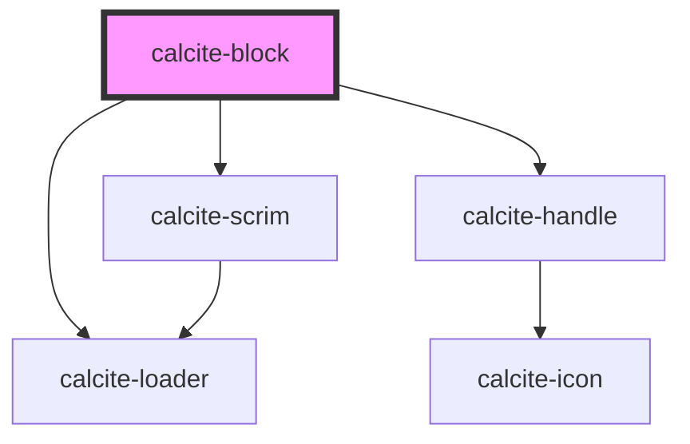

# calcite-block

The `calcite-block` component is intended for displaying a heading and content. Content can also include stacked, collapsible `calcite-block-section`s typically housed in a panel.

<!-- Auto Generated Below -->

## Usage

### Basic

#### Default (non-collapsible)

```html
<calcite-block heading="Fruit" summary="It's nature's candy"> </calcite-block>
```

#### Header with control

Renders a header and control with a slot for adding a single HTML element (in the header).

```html
<calcite-block heading="This header" summary="it has an input">
  <div slot="control"><input placeholder="I am in control">
</calcite-block>
```

#### Header with Icon

Renders a header and icon with the icon.

```html
<calcite-block heading="Icon't believe it!">
  <div slot="icon">🤯</div>
</calcite-block>
```

#### Header with content (always open)

Renders a header and content that remains open - no collapsible option.

```html
<calcite-block heading="When your son becomes a priest, do you call him..." open>
  <div>Father or Son?</div>
</calcite-block>
```

#### Header with content (collapsible)

Renders a header with a clickable icon to toggle the block open and closed.

```html
<calcite-block heading="Domestic pets" open collapsible>
  <calcite-block-section text="puppers rool, kittehs drule"> </calcite-block-section>
</calcite-block>
```

## Properties

| Property       | Attribute       | Description                                                                                 | Type                         | Default        |
| -------------- | --------------- | ------------------------------------------------------------------------------------------- | ---------------------------- | -------------- |
| `collapsible`  | `collapsible`   | When true, this block will be collapsible.                                                  | `boolean`                    | `false`        |
| `disabled`     | `disabled`      | When true, disabled prevents interaction. This state shows items with lower opacity/grayed. | `boolean`                    | `false`        |
| `dragHandle`   | `drag-handle`   | When true, displays a drag handle in the header.                                            | `boolean`                    | `false`        |
| `heading`      | `heading`       | Block heading.                                                                              | `string`                     | `undefined`    |
| `headingLevel` | `heading-level` | Number at which section headings should start for this component.                           | `1 \| 2 \| 3 \| 4 \| 5 \| 6` | `undefined`    |
| `intlCollapse` | `intl-collapse` | Tooltip used for the toggle when expanded.                                                  | `string`                     | `undefined`    |
| `intlExpand`   | `intl-expand`   | Tooltip used for the toggle when collapsed.                                                 | `string`                     | `undefined`    |
| `intlLoading`  | `intl-loading`  | string to override English loading text                                                     | `string`                     | `TEXT.loading` |
| `loading`      | `loading`       | When true, content is waiting to be loaded. This state shows a busy indicator.              | `boolean`                    | `false`        |
| `open`         | `open`          | When true, the block's content will be displayed.                                           | `boolean`                    | `false`        |
| `summary`      | `summary`       | Block summary.                                                                              | `string`                     | `undefined`    |
| `theme`        | `theme`         | Used to set the component's color scheme.                                                   | `"dark" \| "light"`          | `undefined`    |

## Events

| Event                | Description                               | Type               |
| -------------------- | ----------------------------------------- | ------------------ |
| `calciteBlockToggle` | Emitted when the header has been clicked. | `CustomEvent<any>` |

## Slots

| Slot        | Description                                                |
| ----------- | ---------------------------------------------------------- |
|             | A slot for adding content to the block.                    |
| `"control"` | A slot for adding a single HTML input element in a header. |
| `"icon"`    | A slot for adding a trailing header icon.                  |

## Dependencies

### Depends on

- [calcite-scrim](../calcite-scrim)
- [calcite-handle](../calcite-handle)
- [calcite-loader](../calcite-loader)

### Graph



---

_Built with [StencilJS](https://stenciljs.com/)_
