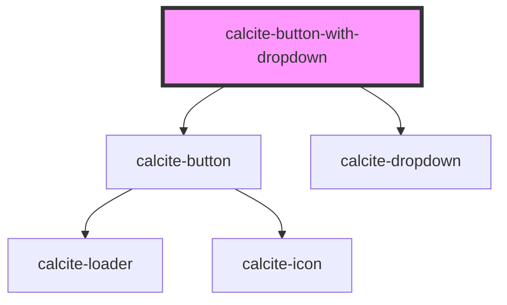

# calcite-button-with-dropdown

<!-- Auto Generated Below -->

## Properties

| Property        | Attribute        | Description                                                                                              | Type                                   | Default     |
| --------------- | ---------------- | -------------------------------------------------------------------------------------------------------- | -------------------------------------- | ----------- |
| `color`         | `color`          | specify the color of the control, defaults to blue                                                       | `"blue" \| "dark" \| "light" \| "red"` | `"blue"`    |
| `disabled`      | `disabled`       | is the control disabled                                                                                  | `boolean`                              | `undefined` |
| `dropdownLabel` | `dropdown-label` | aria label for overflow button                                                                           | `string`                               | `undefined` |
| `loading`       | `loading`        | optionally add a calcite-loader component to the control, disabling interaction. with the primary button | `boolean`                              | `false`     |
| `primaryIcon`   | `primary-icon`   | optionally pass an icon to display on the primary button - accepts Calcite UI icon names                 | `string`                               | `undefined` |
| `primaryLabel`  | `primary-label`  | optionally pass an aria-label for the primary button                                                     | `string`                               | `undefined` |
| `primaryText`   | `primary-text`   | text for primary action button                                                                           | `string`                               | `undefined` |
| `scale`         | `scale`          | specify the scale of the control, defaults to m                                                          | `"l" \| "m" \| "s"`                    | `"m"`       |
| `theme`         | `theme`          | select theme (light or dark), defaults to light                                                          | `"dark" \| "light"`                    | `"light"`   |

## Events

| Event                  | Description                                    | Type               |
| ---------------------- | ---------------------------------------------- | ------------------ |
| `primaryButtonClicked` | fired when the modal begins the open animation | `CustomEvent<any>` |

## Dependencies

### Depends on

- [calcite-button](../calcite-button)
- [calcite-dropdown](../calcite-dropdown)

### Graph

----------------------------------------------

*Built with [StencilJS](https://stenciljs.com/)*
