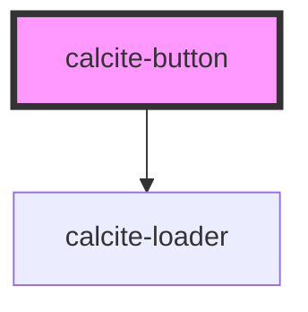

# calcite-button

<!-- Auto Generated Below -->

## Properties

| Property       | Attribute      | Description                                                                                                                            | Type                                          | Default     |
| -------------- | -------------- | -------------------------------------------------------------------------------------------------------------------------------------- | --------------------------------------------- | ----------- |
| `appearance`   | `appearance`   | specify the appearance style of the button, defaults to solid. Specifying "inline" will render the component as an anchor              | `"clear" \| "inline" \| "outline" \| "solid"` | `"solid"`   |
| `color`        | `color`        | specify the color of the button, defaults to blue                                                                                      | `"blue" \| "dark" \| "light" \| "red"`        | `"blue"`    |
| `href`         | `href`         | optionally pass a href - used to determine if the component should render as a button or an anchor                                     | `string`                                      | `undefined` |
| `icon`         | `icon`         | optionally pass icon path data to be positioned within the button - pass only raw path data from calcite ui helper                     | `string`                                      | `undefined` |
| `iconposition` | `iconposition` | optionally used with icon, select where to position the icon                                                                           | `"end" \| "start"`                            | `"start"`   |
| `loading`      | `loading`      | optionally add a calcite-loader component inline to indicate loading is occuring. You can add and remove this prop depending on status | `boolean`                                     | `false`     |
| `scale`        | `scale`        | specify the scale of the button, defaults to m                                                                                         | `"l" \| "m" \| "s" \| "xl" \| "xs"`           | `"m"`       |
| `theme`        | `theme`        | Select theme (light or dark)                                                                                                           | `"dark" \| "light"`                           | `"light"`   |
| `width`        | `width`        | specify the width of the button, defaults to auto                                                                                      | `"auto" \| "full" \| "half"`                  | `"auto"`    |

## Dependencies

### Depends on

- [calcite-loader](../calcite-loader)

### Graph

----------------------------------------------

*Built with [StencilJS](https://stenciljs.com/)*
