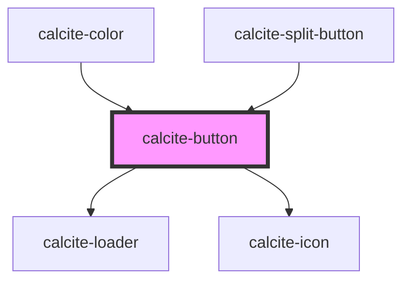

# calcite-button

You can programmatically focus a `calcite-button` with the `setFocus()` method:

`
Focus!
`

<!-- Auto Generated Below -->

## Usage

### Internals

#### Passing attributes to internal components

Any additional attributes set on `<calcite-button>` are passed to the internal `<a>` or `<button>` tag. For example:

- `<calcite-button href="https://github.com/esri/calcite-components target="_blank">Calcite Components on GitHub</calcite-button>` would set `target="_blank` On the internal `<a>`.
- `<calcite-button type="submit">Submit</calcite-button>` would set `type="submit"` On the internal `<button>`.

## Properties

| Property     | Attribute    | Description                                                                                        | Type                                               | Default     |
| ------------ | ------------ | -------------------------------------------------------------------------------------------------- | -------------------------------------------------- | ----------- |
| `appearance` | `appearance` | specify the appearance style of the button, defaults to solid.                                     | `"clear" \| "outline" \| "solid" \| "transparent"` | `"solid"`   |
| `color`      | `color`      | specify the color of the button, defaults to blue                                                  | `"blue" \| "dark" \| "light" \| "red"`             | `"blue"`    |
| `disabled`   | `disabled`   | is the button disabled                                                                             | `boolean`                                          | `undefined` |
| `floating`   | `floating`   | optionally add a floating style to the button - this should be positioned fixed or sticky          | `boolean`                                          | `false`     |
| `href`       | `href`       | optionally pass a href - used to determine if the component should render as a button or an anchor | `string`                                           | `undefined` |
| `iconEnd`    | `icon-end`   | optionally pass an icon to display at the end of a button - accepts calcite ui icon names          | `string`                                           | `undefined` |
| `iconStart`  | `icon-start` | optionally pass an icon to display at the start of a button - accepts calcite ui icon names        | `string`                                           | `undefined` |
| `loading`    | `loading`    | optionally add a calcite-loader component to the button, disabling interaction.                    | `boolean`                                          | `false`     |
| `round`      | `round`      | optionally add a round style to the button                                                         | `boolean`                                          | `false`     |
| `scale`      | `scale`      | specify the scale of the button, defaults to m                                                     | `"l" \| "m" \| "s"`                                | `"m"`       |
| `theme`      | `theme`      | Select theme (light or dark)                                                                       | `"dark" \| "light"`                                | `undefined` |
| `width`      | `width`      | specify the width of the button, defaults to auto                                                  | `"auto" \| "full" \| "half"`                       | `"auto"`    |

## Methods

### `setFocus() => Promise<void>`

#### Returns

Type: `Promise<void>`

## Dependencies

### Used by

- [calcite-color](../calcite-color)
- [calcite-split-button](../calcite-split-button)

### Depends on

- [calcite-loader](../calcite-loader)
- [calcite-icon](../calcite-icon)

### Graph

---

_Built with [StencilJS](https://stenciljs.com/)_
