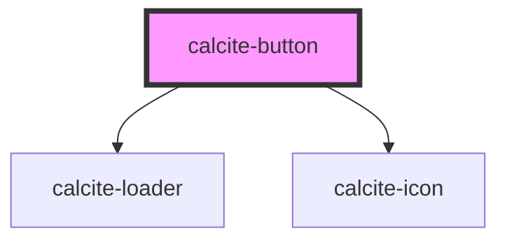

# calcite-button

You can programmatically focus a `calcite-button` with the `setFocus()` method:

`
Focus!
`

<!-- Auto Generated Below -->

## Properties

| Property       | Attribute       | Description                                                                                                               | Type                                          | Default     |
| -------------- | --------------- | ------------------------------------------------------------------------------------------------------------------------- | --------------------------------------------- | ----------- |
| `appearance`   | `appearance`    | specify the appearance style of the button, defaults to solid. Specifying "inline" will render the component as an anchor | `"clear" \| "inline" \| "outline" \| "solid"` | `"solid"`   |
| `color`        | `color`         | specify the color of the button, defaults to blue                                                                         | `"blue" \| "dark" \| "light" \| "red"`        | `"blue"`    |
| `disabled`     | `disabled`      | is the button disabled                                                                                                    | `boolean`                                     | `undefined` |
| `floating`     | `floating`      | optionally add a floating style to the button - this should be positioned fixed or sticky                                 | `boolean`                                     | `false`     |
| `href`         | `href`          | optionally pass a href - used to determine if the component should render as a button or an anchor                        | `string`                                      | `undefined` |
| `icon`         | `icon`          | optionally pass an icon to display - accepts Calcite UI icon names                                                        | `string`                                      | `undefined` |
| `iconPosition` | `icon-position` | optionally used with icon, select where to position the icon                                                              | `"end" \| "start"`                            | `"start"`   |
| `loading`      | `loading`       | optionally add a calcite-loader component to the button, disabling interaction.                                           | `boolean`                                     | `false`     |
| `round`        | `round`         | optionally add a round style to the button                                                                                | `boolean`                                     | `false`     |
| `scale`        | `scale`         | specify the scale of the button, defaults to m                                                                            | `"l" \| "m" \| "s" \| "xl" \| "xs"`           | `"m"`       |
| `theme`        | `theme`         | Select theme (light or dark)                                                                                              | `"dark" \| "light"`                           | `undefined` |
| `width`        | `width`         | specify the width of the button, defaults to auto                                                                         | `"auto" \| "full" \| "half"`                  | `"auto"`    |

## Methods

### `setFocus() => Promise<void>`

#### Returns

Type: `Promise<void>`

## Dependencies

### Depends on

- [calcite-loader](../calcite-loader)
- [calcite-icon](../calcite-icon)

### Graph

----------------------------------------------

*Built with [StencilJS](https://stenciljs.com/)*
