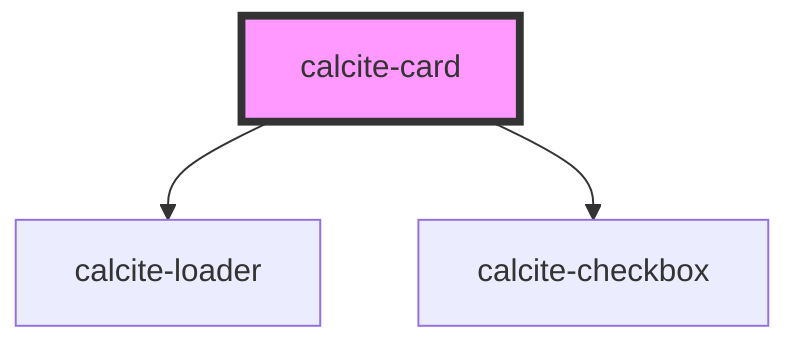

# calcite-card

<!-- Auto Generated Below -->

## Properties

| Property     | Attribute    | Description                                                                              | Type                | Default   |
| ------------ | ------------ | ---------------------------------------------------------------------------------------- | ------------------- | --------- |
| `loading`    | `loading`    | When true, the cards content is waiting to be loaded. This state shows a busy indicator. | `boolean`           | `false`   |
| `selectable` | `selectable` | Indicates whether the card is selectable.                                                | `boolean`           | `false`   |
| `selected`   | `selected`   | Indicates whether the card is selected.                                                  | `boolean`           | `false`   |
| `theme`      | `theme`      | The theme of the card.                                                                   | `"dark" \| "light"` | `"light"` |

## Events

| Event                 | Description                              | Type               |
| --------------------- | ---------------------------------------- | ------------------ |
| `calciteCardSelected` | Fired when a selectable card is selected | `CustomEvent<any>` |

## Dependencies

### Depends on

- [calcite-loader](../calcite-loader)
- [calcite-checkbox](../calcite-checkbox)

### Graph

----------------------------------------------

*Built with [StencilJS](https://stenciljs.com/)*
