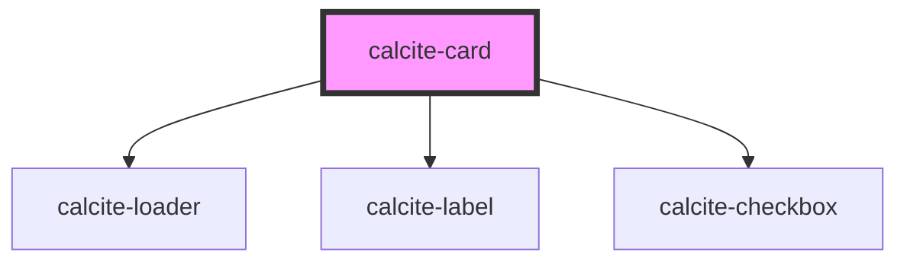

# calcite-card

<!-- Auto Generated Below -->

## Usage

### Basic

```html
<div style="width:260px">
  <calcite-card>
    <h3 slot="title">ArcGIS Online: Gallery and Organization pages</h3>
    <span slot="subtitle">
      A great example of a study description that might wrap to a line or two, but isn't overly verbose.
    </span>
  </calcite-card>
</div>
```

## Properties

| Property       | Attribute       | Description                                                                              | Type      | Default         |
| -------------- | --------------- | ---------------------------------------------------------------------------------------- | --------- | --------------- |
| `intlDeselect` | `intl-deselect` | string to override English deselect text for checkbox when selectable is true            | `string`  | `TEXT.deselect` |
| `intlLoading`  | `intl-loading`  | string to override English loading text                                                  | `string`  | `TEXT.loading`  |
| `intlSelect`   | `intl-select`   | string to override English select text for checkbox when selectable is true              | `string`  | `TEXT.select`   |
| `loading`      | `loading`       | When true, the cards content is waiting to be loaded. This state shows a busy indicator. | `boolean` | `false`         |
| `selectable`   | `selectable`    | Indicates whether the card is selectable.                                                | `boolean` | `false`         |
| `selected`     | `selected`      | Indicates whether the card is selected.                                                  | `boolean` | `false`         |

## Events

| Event               | Description                              | Type               |
| ------------------- | ---------------------------------------- | ------------------ |
| `calciteCardSelect` | Fired when a selectable card is selected | `CustomEvent<any>` |

## Slots

| Slot                | Description                                         |
| ------------------- | --------------------------------------------------- |
|                     | A slot for adding subheader/description content.    |
| `"footer-leading"`  | A slot for adding a leading footer.                 |
| `"footer-trailing"` | A slot for adding a trailing footer.                |
| `"subtitle"`        | A slot for adding a card subtitle or short summary. |
| `"thumbnail"`       | A slot for adding a thumbnail to the card.          |
| `"title"`           | A slot for adding a card title.                     |

## Dependencies

### Depends on

- [calcite-loader](../calcite-loader)
- [calcite-label](../calcite-label)
- [calcite-checkbox](../calcite-checkbox)

### Graph



---

_Built with [StencilJS](https://stenciljs.com/)_
