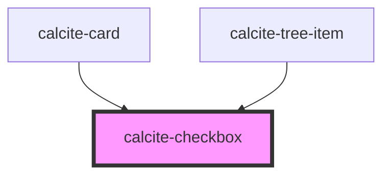

# calcite-checkbox

<!-- Auto Generated Below -->

## Usage

### Basic

```html
<calcite-checkbox id="first-name" name="first-name"></calcite-checkbox>
```

### Checked-with-calcite-label

```html
<calcite-label layout="inline" for="checked-item">
  To do
  <calcite-checkbox checked id="checked-item" name="checked-item"></calcite-checkbox>
</calcite-label>
```

### Hovered-with-calcite-label

```html
<calcite-label layout="inline" for="hovered-item">
  <calcite-checkbox hovered id="hovered-item" name="hovered-item"></calcite-checkbox>
  To do
</calcite-label>
```

### Indeterminate-with-native-label

```html
<label for="checked-indeterminate">
  Status
  <calcite-checkbox checked indeterminate id="checked-indeterminate" name="checked-indeterminate"></calcite-checkbox>
</label>
```

## Properties

| Property        | Attribute       | Description                                                                                                                                   | Type                | Default     |
| --------------- | --------------- | --------------------------------------------------------------------------------------------------------------------------------------------- | ------------------- | ----------- |
| `checked`       | `checked`       | The checked state of the checkbox.                                                                                                            | `boolean`           | `false`     |
| `disabled`      | `disabled`      | True if the checkbox is disabled                                                                                                              | `boolean`           | `false`     |
| `guid`          | `guid`          | The id attribute of the checkbox. When omitted, a globally unique identifier is used.                                                         | `string`            | `undefined` |
| `hovered`       | `hovered`       | The hovered state of the checkbox.                                                                                                            | `boolean`           | `false`     |
| `indeterminate` | `indeterminate` | True if the checkbox is initially indeterminate, which is independent from its checked state https://css-tricks.com/indeterminate-checkboxes/ | `boolean`           | `false`     |
| `name`          | `name`          | The name of the checkbox input                                                                                                                | `string`            | `""`        |
| `scale`         | `scale`         | specify the scale of the checkbox, defaults to m                                                                                              | `"l" \| "m" \| "s"` | `"m"`       |
| `value`         | `value`         | The value of the checkbox input                                                                                                               | `any`               | `undefined` |

## Events

| Event                   | Description                                      | Type               |
| ----------------------- | ------------------------------------------------ | ------------------ |
| `calciteCheckboxChange` | Emitted when the checkbox checked status changes | `CustomEvent<any>` |

## Methods

### `setFocus() => Promise<void>`

#### Returns

Type: `Promise<void>`

## Dependencies

### Used by

- [calcite-card](../calcite-card)
- [calcite-tree-item](../calcite-tree-item)

### Graph



---

_Built with [StencilJS](https://stenciljs.com/)_
