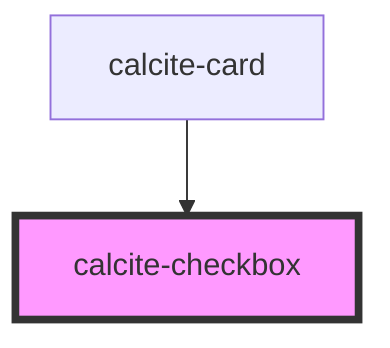

# calcite-checkbox

calcite-checkbox is used to toggle a value on or off. You can optionally pass in a checkbox. This is useful when using a framework like React to get around their synthetic event handling:

```jsx
<calcite-checkbox>
  <input name="myCheckbox" type="checkbox" onChange={this.handleInputChange} />
</calcite-checkbox>
```

If you don't pass in an input, calcite-checkbox will act as the source of truth:

```html
<label> <calcite-checkbox checked="true"></calcite-checkbox> Switch is on </label>
```

<!-- Auto Generated Below -->

## Properties

| Property        | Attribute       | Description                                                                                                                                   | Type                | Default     |
| --------------- | --------------- | --------------------------------------------------------------------------------------------------------------------------------------------- | ------------------- | ----------- |
| `checked`       | `checked`       | The checked state of the checkbox.                                                                                                            | `boolean`           | `false`     |
| `disabled`      | `disabled`      | True if the checkbox is disabled                                                                                                              | `boolean`           | `false`     |
| `focused`       | `focused`       | The focused state of the checkbox.                                                                                                            | `boolean`           | `false`     |
| `hovered`       | `hovered`       | The hovered state of the checkbox.                                                                                                            | `boolean`           | `false`     |
| `indeterminate` | `indeterminate` | True if the checkbox is initially indeterminate, which is independent from its checked state https://css-tricks.com/indeterminate-checkboxes/ | `boolean`           | `false`     |
| `name`          | `name`          | The name of the checkbox input                                                                                                                | `string`            | `""`        |
| `scale`         | `scale`         | specify the scale of the checkbox, defaults to m                                                                                              | `"l" \| "m" \| "s"` | `"m"`       |
| `theme`         | `theme`         | Determines what theme to use                                                                                                                  | `"dark" \| "light"` | `undefined` |
| `value`         | `value`         | The value of the checkbox input                                                                                                               | `string`            | `""`        |

## Events

| Event                   | Description                                      | Type               |
| ----------------------- | ------------------------------------------------ | ------------------ |
| `calciteCheckboxChange` | Emitted when the checkbox checked status changes | `CustomEvent<any>` |

## Dependencies

### Used by

- [calcite-card](../calcite-card)

### Graph



---

_Built with [StencilJS](https://stenciljs.com/)_
