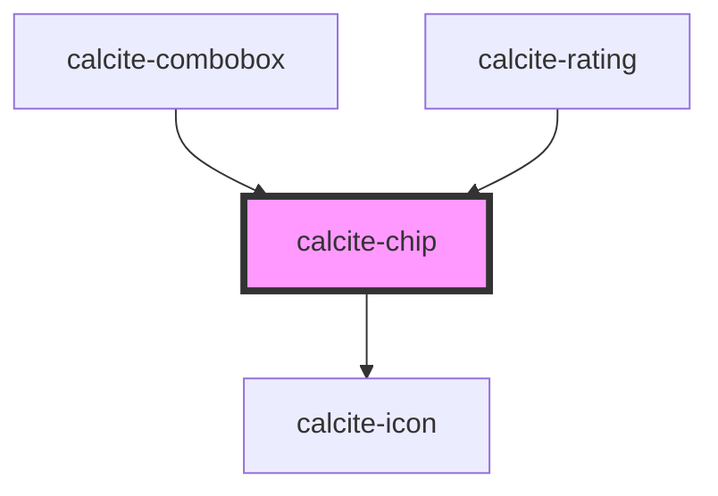

# calcite-chip

<!-- Auto Generated Below -->

## Properties

| Property             | Attribute     | Description                                                        | Type                                               | Default     |
| -------------------- | ------------- | ------------------------------------------------------------------ | -------------------------------------------------- | ----------- |
| `appearance`         | `appearance`  | specify the appearance style of the button, defaults to solid.     | `"clear" \| "solid"`                               | `"solid"`   |
| `color`              | `color`       | specify the color of the button, defaults to blue                  | `"blue" \| "green" \| "grey" \| "red" \| "yellow"` | `"grey"`    |
| `dismissible`        | `dismissible` | Optionally show a button the user can click to dismiss the chip    | `boolean`                                          | `false`     |
| `icon`               | `icon`        | optionally pass an icon to display - accepts Calcite UI icon names | `string`                                           | `undefined` |
| `scale`              | `scale`       | specify the scale of the chip, defaults to m                       | `"l" \| "m" \| "s"`                                | `"m"`       |
| `theme`              | `theme`       | Select theme (light or dark)                                       | `"dark" \| "light"`                                | `undefined` |
| `value` _(required)_ | `value`       |                                                                    | `string`                                           | `undefined` |

## Events

| Event                | Description                                | Type               |
| -------------------- | ------------------------------------------ | ------------------ |
| `calciteChipDismiss` | Emitted when the dismiss button is clicked | `CustomEvent<any>` |

## Dependencies

### Used by

- [calcite-combobox](../calcite-combobox)
- [calcite-rating](../calcite-rating)

### Depends on

- [calcite-icon](../calcite-icon)

### Graph

---

_Built with [StencilJS](https://stenciljs.com/)_
