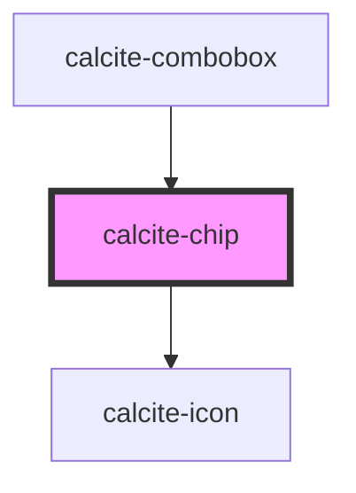

# calcite-chip

<!-- Auto Generated Below -->

## Properties

| Property             | Attribute | Description                                                        | Type                                | Default     |
| -------------------- | --------- | ------------------------------------------------------------------ | ----------------------------------- | ----------- |
| `icon`               | `icon`    | optionally pass an icon to display - accepts Calcite UI icon names | `string`                            | `undefined` |
| `scale`              | `scale`   | specify the scale of the chip, defaults to m                       | `"l" \| "m" \| "s" \| "xl" \| "xs"` | `"m"`       |
| `theme`              | `theme`   | Select theme (light or dark)                                       | `"dark" \| "light"`                 | `undefined` |
| `value` _(required)_ | `value`   |                                                                    | `string`                            | `undefined` |

## Events

| Event                | Description | Type               |
| -------------------- | ----------- | ------------------ |
| `calciteChipDismiss` |             | `CustomEvent<any>` |

## Dependencies

### Used by

- [calcite-combobox](../calcite-combobox)

### Depends on

- [calcite-icon](../calcite-icon)

### Graph

---

_Built with [StencilJS](https://stenciljs.com/)_
