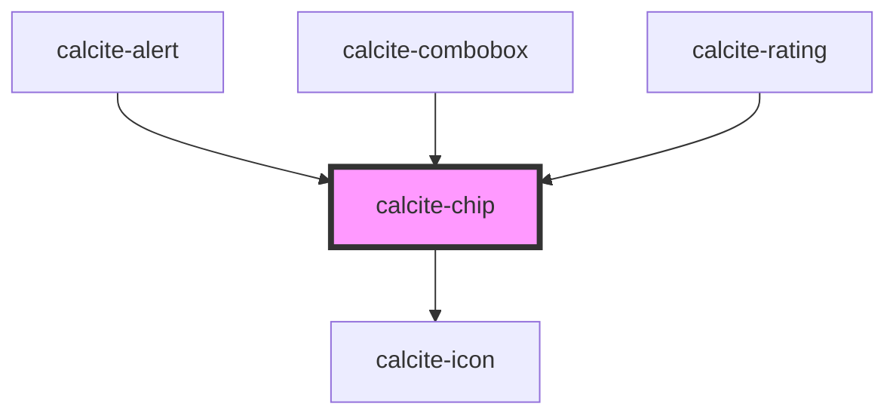

# calcite-chip

<!-- Auto Generated Below -->

## Usage

### Basic

```html
<calcite-chip value="Global" dismissible icon="globe" appearance="clear" color="green">Global</calcite-chip>
```

## Properties

| Property             | Attribute       | Description                                                        | Type                                               | Default      |
| -------------------- | --------------- | ------------------------------------------------------------------ | -------------------------------------------------- | ------------ |
| `appearance`         | `appearance`    | specify the appearance style of the button, defaults to solid.     | `"clear" \| "solid"`                               | `"solid"`    |
| `color`              | `color`         | specify the color of the button, defaults to blue                  | `"blue" \| "green" \| "grey" \| "red" \| "yellow"` | `"grey"`     |
| `dismissLabel`       | `dismiss-label` | Aria label for the "x" button                                      | `string`                                           | `TEXT.close` |
| `dismissible`        | `dismissible`   | Optionally show a button the user can click to dismiss the chip    | `boolean`                                          | `false`      |
| `icon`               | `icon`          | optionally pass an icon to display - accepts Calcite UI icon names | `string`                                           | `undefined`  |
| `iconFlipRtl`        | `icon-flip-rtl` | flip the icon in rtl                                               | `boolean`                                          | `false`      |
| `scale`              | `scale`         | specify the scale of the chip, defaults to m                       | `"l" \| "m" \| "s"`                                | `"m"`        |
| `value` _(required)_ | `value`         | The assigned value for the chip                                    | `any`                                              | `undefined`  |

## Events

| Event                | Description                                | Type               |
| -------------------- | ------------------------------------------ | ------------------ |
| `calciteChipDismiss` | Emitted when the dismiss button is clicked | `CustomEvent<any>` |

## Methods

### `setFocus() => Promise<void>`

Sets focus on the component.

#### Returns

Type: `Promise<void>`

## Slots

| Slot      | Description                 |
| --------- | --------------------------- |
|           | A slot for adding text.     |
| `"image"` | A slot for adding an image. |

## Dependencies

### Used by

- [calcite-alert](../calcite-alert)
- [calcite-combobox](../calcite-combobox)
- [calcite-rating](../calcite-rating)

### Depends on

- [calcite-icon](../calcite-icon)

### Graph



---

_Built with [StencilJS](https://stenciljs.com/)_
