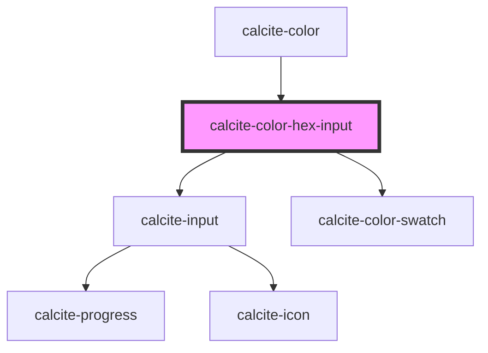

# calcite-hex-input

<!-- Auto Generated Below -->

## Properties

| Property  | Attribute  | Description                   | Type                | Default                             |
| --------- | ---------- | ----------------------------- | ------------------- | ----------------------------------- |
| `intlHex` | `intl-hex` | Label used for the hex input. | `string`            | `TEXT.hex`                          |
| `scale`   | `scale`    | The component's scale.        | `"l" \| "m" \| "s"` | `"m"`                               |
| `theme`   | `theme`    | The component's theme.        | `"dark" \| "light"` | `"light"`                           |
| `value`   | `value`    | The hex value.                | `string`            | `normalizeHex(DEFAULT_COLOR.hex())` |

## Events

| Event                        | Description                         | Type               |
| ---------------------------- | ----------------------------------- | ------------------ |
| `calciteColorHexInputChange` | Emitted when the hex value changes. | `CustomEvent<any>` |

## Methods

### `setFocus() => Promise<void>`

Sets focus on the component.

#### Returns

Type: `Promise<void>`

## Dependencies

### Used by

 - [calcite-color](../calcite-color)

### Depends on

- [calcite-input](../calcite-input)
- [calcite-color-swatch](../calcite-color-swatch)

### Graph

----------------------------------------------

*Built with [StencilJS](https://stenciljs.com/)*
