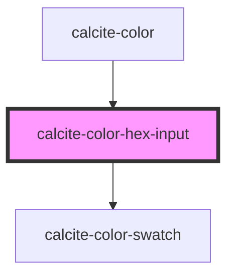

# calcite-hex-input

<!-- Auto Generated Below -->

## Properties

| Property   | Attribute   | Description                   | Type                | Default                             |
| ---------- | ----------- | ----------------------------- | ------------------- | ----------------------------------- |
| `hexLabel` | `hex-label` | Label used for the hex input. | `string`            | `"Hex"`                             |
| `scale`    | `scale`     | The component's scale.        | `"l" \| "m" \| "s"` | `"m"`                               |
| `theme`    | `theme`     | The component's theme.        | `"dark" \| "light"` | `"light"`                           |
| `value`    | `value`     | The hex value.                | `string`            | `normalizeHex(DEFAULT_COLOR.hex())` |

## Events

| Event                   | Description                         | Type               |
| ----------------------- | ----------------------------------- | ------------------ |
| `calciteHexInputChange` | Emitted when the hex value changes. | `CustomEvent<any>` |

## Methods

### `setFocus() => Promise<void>`

Focuses the input.

#### Returns

Type: `Promise<void>`

## Dependencies

### Used by

- [calcite-color](../calcite-color)

### Depends on

- [calcite-color-swatch](../calcite-color-swatch)

### Graph

---

_Built with [StencilJS](https://stenciljs.com/)_
