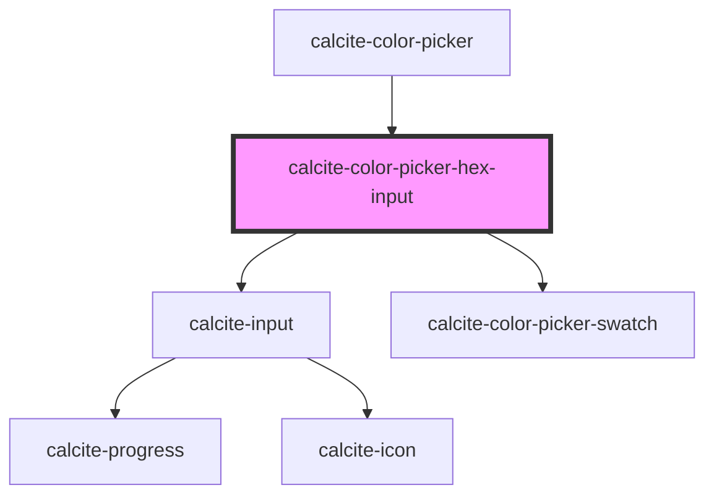

# calcite-hex-input

<!-- Auto Generated Below -->

## Properties

| Property      | Attribute       | Description                                                                                                                                                                                                                                     | Type                | Default                             |
| ------------- | --------------- | ----------------------------------------------------------------------------------------------------------------------------------------------------------------------------------------------------------------------------------------------- | ------------------- | ----------------------------------- |
| `allowEmpty`  | `allow-empty`   | When false, empty color (null) will be allowed as a value. Otherwise, a color value is always enforced by the component. When true, clearing the input and blurring will restore the last valid color set. When false, it will set it to empty. | `boolean`           | `false`                             |
| `intlHex`     | `intl-hex`      | Label used for the hex input.                                                                                                                                                                                                                   | `string`            | `TEXT.hex`                          |
| `intlNoColor` | `intl-no-color` | Label used for the hex input when there is no color selected.                                                                                                                                                                                   | `string`            | `TEXT.noColor`                      |
| `scale`       | `scale`         | The component's scale.                                                                                                                                                                                                                          | `"l" \| "m" \| "s"` | `"m"`                               |
| `theme`       | `theme`         | The component's theme.                                                                                                                                                                                                                          | `"dark" \| "light"` | `"light"`                           |
| `value`       | `value`         | The hex value.                                                                                                                                                                                                                                  | `string`            | `normalizeHex(DEFAULT_COLOR.hex())` |

## Events

| Event                              | Description                         | Type               |
| ---------------------------------- | ----------------------------------- | ------------------ |
| `calciteColorPickerHexInputChange` | Emitted when the hex value changes. | `CustomEvent<any>` |

## Methods

### `setFocus() => Promise<void>`

Sets focus on the component.

#### Returns

Type: `Promise<void>`

## Dependencies

### Used by

- [calcite-color-picker](../calcite-color-picker)

### Depends on

- [calcite-input](../calcite-input)
- [calcite-color-picker-swatch](src/components/calcite-color-picker-swatch)

### Graph

---

_Built with [StencilJS](https://stenciljs.com/)_
